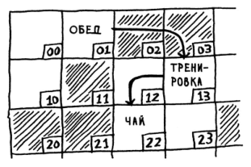
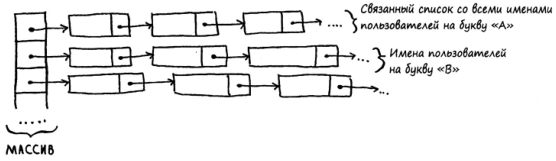
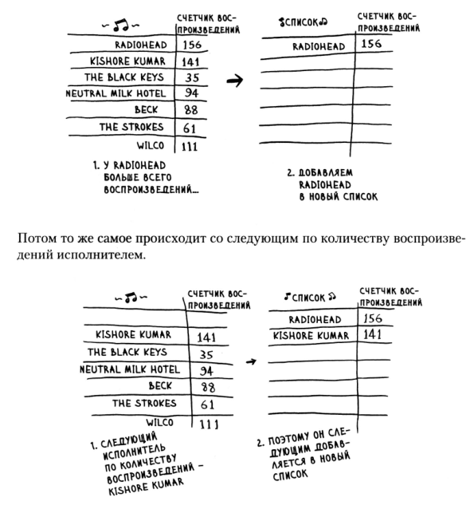

# Грокаем Алгоритмы

# Знакомство с алгоритмами
Алгоритм - набор инструкций для выполнения некоторой задачи.
<br>

## Бинарный поиск
На входе алгоритм получает отсортированный список элементов. И возвращает позицию искомого элемента, если он есть в списке элементов, в противном случае вернет null.
![[binary_search.png]]
Шаг 1: 55? Много. - Сразу же отметается огромный массив чисел от 55 до 82.
Шаг 2: 34? Мало. - Отметаем все числа от 6 до 34
шаг 3: 44? Да

Сколько шагов понадобится, если я ищу слово в словаре из 240 000 элементов? В худшем случае. (загаданное число первое или последнее в списке)
Простой перебор: 240 000, просто буду прибавлять 1, пока не дойду до конца списка
Бинарный поиск: 2^18 - 18 шагов. То есть log2(240 000) = 17,8 = 18.
То есть __сложность бинарного поиска:__ O(log2(N) = O(log N), так как log без основания, в случае с алгоритмами, всегда означает log2

__Время выполнения__
Если список состоит из 100 элементов, то поиск займет 7 попыток, 
если список состоит из 4 миллиардов, то поиск займет 32 попытки.
То есть имеем логарифмическое время выполнения.
В случае с просытм перебором имеем линейное время, так как 100 элементов - 100 попыток и т.д.
<br>

## O-Большое
Это специальная нотация, которая описывает скорость алгоритма. Это нужно для удобство выбора алгоритма, оценки его скорости выполнения, так как время выполнение каждого алгоритма растет с разной скоростью.
O-большое показывает с какой скоростью растет время выполнение алгоритма с ростом входных данных.
О-большое не сообщает скорость в секундах, а позволяет сравнить количество операций.
О-большое определяет время выполнения алгоритма в худшем случае.

__Самые популярные разновидности О-большое__
* __O(log n)__ - логарифмическое время: бинарный поиск
* __O(n)__ - Линейное время: простой поиск
* __O(n * log n)__ - эффективные алгоритмы сортировки: быстрая сортировка
* __O(n^2)__ - медленные алгоритмы сортировки: сортировка выбором
* __O(n!)__ - очень медленные алгоритмы: задача коммивояжера.
![[algorytm_graphics.png]]
## Итоги
* Скорость алгоритмов измеряется не в секундах, а в темпе роста колличества операций. Насколько быстро растет кол-во операций, с увелиением кол-ва данных.
* Время выполнения O(log n) быстрее O(n), а с увеличением размера списка, в котором ищется значение. оно становится __намного__ быстрее.

# Список и Массив
Чтение   O(n) O(1)
Вставка  O(1) O(n)
Удаление O(1) O(n)

__Массивы__
Массив хранится в памяти последовательно, ячейки расположены друг с другом, если нужно добавить новый элемент, а ячейка рядюом занята, то придется создавать новый массив с вместительностью + 1 в другом месте памяти.
Так как массив хранится последовательно, мы всегда можем очень быстро прочитать любое значение в массиве, так как знаем где конкретно н аходится каждый элемент.
При удалении элемента (в худшем случае в середние) придется сдвигать все элементы, а это опять создание нового массива.
Когда использовать? Когда мало вставок и удалений, но много чтения.

<br>

__Списки__
Списки хранятся в памяти в любой доступной ячеке, так как каждый предыдущий элемент знает о последующем элементе списка. 1 знает адрес 2, 2 знает адрес 3, 3 знает адрес 4 и так далее.
Из-за этого выделение памяти на новй элемент списка происходит с постоянной скоростью. Просто в элемент добавляется ссылка на новый элемент. Даже если добавление в середину, просто меняются 2 ссылки предыдущего и следующего элемента.
Удаление так же происходит очень быстро - меняются ссылки, либо вовсе удаляются.
А вот чтение имеет линейную скорость, так как в худшем случае, если нам нужен объект в середине, и даже если у нас двусвязный список м будем последовательно, снача 1 элемент, потом 2, читать их, пока не дойдем до нужного.
Но если программа подразумевает ПОСЛЕДОВАТЕЛЬНОЕ чтение, то в этом нет проблемы.

<br>

Из этих простейших структур, можно составлять составные, например массив списков.
В данном случае поиск медленнее, чем для массивов и быстрее, чем для связных списков.
Вставка - быстрее. чем для массивов, с такой же скоростью, для связных списков.

<br>

# Сортировка выбором

<br>

1) Находим самый большшой элемент в первом списке и добавляем его во второй.
2) Затем находим следующий по величине элемент и опять добавляем его во второй список.

__Скорость алгоритма O(n*n)__
Для начала нужно найти самый большой элемент - проходимся по всему списку, сравнивая элементы друг с другом, в худшем случае придется сравнивать абсолютно все элементы, значит скорость O(n).
Затем убираем этот элемент и проделываем поиск следующего элемента таким же образом. Получается, что операцию O(n) нужно проделать n раз.
На самом деле каждый раз будет n-1, n-2, n-3 и т.д., но константы игнорируются, поэтому
O(n) * n = O(n*n).

# Рекурсия
Самая простая рекурсия - обратный отсчет.
```Java
void countDown(int i){
    System.out.println(i);
    if(i <= 1) return;
    countdown(i - 1);
}
```
Здесь __Базовый случай__: if(i <= 1) return; - эта часть нужна, чтобы остановить рекурсию.
__Рекурсивный случай__: countdown(i - 1); - эта часть нужна, чтобы зарекурсить.

__Стек вызовов__
Это очень важное понятие, для понимание работы рекурсии и вообще того, как работает компьютер.
Например вызывается функция __function1()__, которая внутри содержит еще 2 функции, тогда работа будет выглядеть так:

function1(){
    function2();
    function3();
}

Сначала вызывается __function1()__ и добавляется наверх стека, затем внутри функции вызывается __function2()__ и так же кладется наверх стека, над __function1()__

Стек:
->function2()
  function1()

Затем функция __function2()__ выполнилась и она убиратеся из стека.

Стек:
           function2() ->
function1()

Все это время __function1()__ все еще ждет. Дальше вызывается функция __function3()__.

Стек:
->function3()
  function1()

__function3()__ выполняется и убирается из стека, а __function1()__ все еще ждет.

Стек:
            function3() ->
  function1()

И наконец, когда все внутренние функции выполнены, выполняется __function1()__.

Стек:
function1() ->

Из проблем можно выделить то, что вся промежуточная инормация сохраняется. Например функция вызывает саму себя дохуища раз и тогда нужно сохранить дохуища информации, каждой вызванной функции.
Решение 2:
1) Переписать, с исопльзованием обычного цикла
2) Хвостовая рекурсия (поддерживается не во всех языках).
Хвостовая рекурсия - это когда любой рекурсивный вызов является последней операцией перед возвратом из функции.