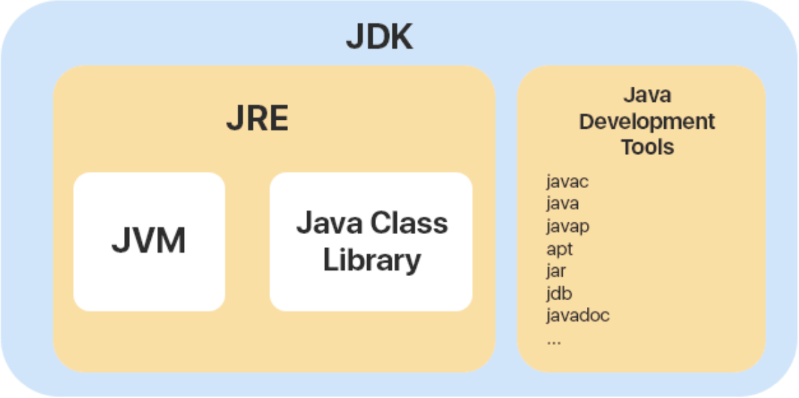

## Общие принципы
1. Какие знаете шаблоны проектирования? Расскажите о двух шаблонах, которые использовали в работе.
2. В чем преимущества и недостатки ООП, если сравнивать с процедурным/функциональным программированием?
3. Чем отличается агрегация от композиции?
4. Какие паттерны GoF вы использовали на практике? Приведите примеры.
5. SOLID
6. Патерны проектирования


## Java Core
1. __Какие есть типы данных в Java?__
    В Java есть 2 группы типов. Примитивные и ссылочные. Примитивные типы занимают фиксированное место в памяти и не могут превышать размер, который под них выделен. Они хранятся в стеке, и хранятся напрямую значения. Поэтому доступ к ним очень быстрый.
    Ссылочные типы - хранятся в куче, соответственно выделяется память только под ссылку, которая ведет к значению, которое хранится в куче. Относительно медленный доступ.
    Примитивные:
    boolean, char, byte, short, int, long, float, double, Void
    Ссылочные: String, Object, все классы, интерфейсы и массивы

2. __Чем отличается объект от примитивных типов данных?__
    Автоупаковка - преобразование примитивного типа в соответствующий объект. Начиная с JDK5, эта функция стала автоматическая. 
    ```Java 
    Integer integer = 9;
    ```
    Распаковка - преобразование объектов в соответствующие примитивные типы. 
    ```Java 
    int in = 9; 
    in = new Integer(9);
    ```
    Примитивные типы находятся в стеке, быстро доступны. Ссылочные типы находятся в куче и относительно медленно доступны. У примитивных типов нет методов, которые доступны соответствующим Объектам. При сравнении объектов - сравниваются ссылки, а при сравнении примитивов сравнивются значения.

3. __В чем разница передачи параметров по ссылке и по значению?__
    При передачи параметров по ссылке, передается ссылка, на место в памяти, где находится находится само значение. И в дальнейшем будет меняться значение, но ссылка останется неизменной.
    В случае, когда передается значение, то передается копия значения. То есть дальнейшая работа будет происходить с дубликатом.

4. __Что такое JRE, JVM, JDK?__
    [Статья о JVM, JDK, JRE](https://topjava.ru/blog/what-is-the-jdk)
    
    JRE - создает и запускает JVM. JRE представляет собой пакет инструментов для запуска Java-кода.

    JVM - Java virtual machine - Программа, которая выполняет и запускает другие программы на основе Java. JVM имеет две освновные функции:
    1. Позволяет запускать программы, написанные на java, на любых устройствах или операционных системах. "Написал один раз, запускай везде".
    2. Управляет и оптимизирует память, которую используют программы.
    
    JDK - Java Development Kit. Бесплатно распространяемый комплект разработчика приложений на языке Java, в который входит компилятор Java, стандартные библиотеки, примеры, документация, утилиты и исполнительная система Java.
    
    Компилятор — это программа, способная принимать исходные файлы с расширением .java, которые являются обычным текстом, кодом, понятным программисту и превращать их в исполняемые файлы с расширением .class.

    1. Пишем код на Java.
    ```Java
        public class Solution {
        public static void main(String[] args) {
            System.out.println("Welcome to the JDK!");
        }
    }
    ```
    1. Компилируем. Эта команда говорит комплиятору Java перевести тексовый файл Java в исполняемую программу. Байт-код, расширение .class
    в Intelije можно найти .class файлы в папке target
    ```Java
    javac Solution.java
    ```
    1. Запуск исполняемого .class-файла
    ```Java
    java Solution
    ```

5. __Что такое Сборка мусора?__
    [Статья о сборке мусора](https://habr.com/ru/company/otus/blog/553996/)
    В Java JVM с помощью этого процесса непрерывно определяет и удаляет нуиспользуемую память в Java - приложениях.
    Мусором считается объект, который больше не может быть достигнут по ссылке из какого-либо объекта. Поскольку такие объекты больше не используются в приложении, то их можно удалить из памяти.

    Очистка происходит в 3 этапа
    1. __Mark (маркировка)__ - Выполнение программы останавливается (Stop the world), помечаются все "живые" объекты, которые до сих пор исопльзуются.
    2. __Sweep (очистка)__ - Освобождается память. "Удаляются все объекты, которые не были помечены на 1 шаге.
    3. __Compaction (уплотнение)__ - Оставшиеся объекты перемещаются в один непрерывный блок памяти, для ускорения добавления новых объектов.

    

    Для оптимизации работы куча разбита на 4 раздела. В каждый из них помещаются данные на основе их "возраста".
    Когда заполняется область Эдем новыми объектами, происходит __Minor GC__ минорная сборка мусора. Маркировка и очистка для молодого поколения. Все выжившие объекты после этой минорной очистки отправляются в s0 и s1.
    С каждой новой очисткой возраст выживших увеличивается и они перемещаются дальше, пока не попадут в OLD.
    Old очищается при __Major GC__ мажорной очистке мусора.
    Недостаток такой системы маркировки в том, что в каждый момент времени один из s0 или s1 является пустым.
    Преимущества в том, что минорная очистка происходит не на всей куче, а только на 2\3 и там в осноном мертвые объекты. 

    

6. __Зачем используют JVM?__
    __Java Virtual Machine__ - виртуальная машина java, которая позволяет запускать программы, написанные на языке java на любом другом устройстве. Переводит написанный программистом код-текст __.java__ в байт-код __.class__. А так же управляет памятью и оптимизирует работу программы с помощью (__garbige collector__) сборщика мусора. 
7. Что такое bytecode?
    [Статья про байт-код](https://habr.com/ru/post/568402/)
8. Какие признаки JavaBean?
9. Что такое OutOfMemoryError?
10. Что такое стектрейс? Как его получить?
11. Назовите все методы класса object.
12. В чем отличие между try-with-resources и try-catch-finally при работе с ресурсами?
13. Что такое конструкторы? Какие типы знаете?
14. Что такое побитовые операции?
15. Объекты каких стандартных классов immutable в Java?
16. Дайте краткую характеристику immutable object. Зачем они нужны?
17. Как создать immutable object?
18. Какие преимущества immutable object перед обычными объектами?
19. __Где хранятся данные?__
    1. __Регистры__ - самое быстрое хранилище. Данные хранятся напрямую в процессоре. Кол-во регистров жестко ограниченно, поэтому они исполььзуются компилятором по мере необходимости. В Java нет способа сохранять данные в регистрах, в C и C++ - есть.
    2. __Стек__ - Область памяти, находящаяся в RAM - оперативная память. Процессор предоставляет прямой доступ к ней с помощьью указателей стека. Указатель ьстека перемещается вниз для выделения памяти или вверх для освобождения. Некоторые данные хранятся в стеге (особенно ссылки на объекты), сами же обхекты не помещаются в стек. Процессору важно знать цикл жизни каждого объекта.
    3. __Куча__ - Пул объектов общего назначения, так же находится в RAM. В него помещаются все объекты Java. Преимущество в том, что процессору не нужно знаь цикл жизни объекта. Это дает гибкость при работе с кучей. При создании объекта - выделяется памятьв куче, за гибкость платим платим тем, что память выделяется дольше. 
    4. __Постоянное хранилище__ - Значения констант часто встаиваются прямо в код программы, так как они неизменяемы. Иногда такие данные могут размещаться в постоянной памяти ROM. Все строковые литералы и константы со строковыми значениями автоматически помещаются в специальную статическую область памяти.
    5. __Внешнее хранилище__ - Если данные хранятся вне программы, они могут существовать и тогда, когда она не выполняется. Два основных примера:
    __(Streamed objects) потоковые объекты__ - объекы представлены в виде потока байов.
    __(Persistent objects) долгоживущие объекты__ - запоминаются на диске и схоряняют свое состояние даже после окончания работы программы. 
    Особеннось таких данных в том, что их можно хранить на другом носителе инофрмации.
    В Java организованна поддержка легковесного (lightweight) сохранения состояния, а так же механизмы, как JDBC и Hibernate, предоставляющие более совершенную поддержку сохранения и выборки информации об объектах из баз данных.
    
    __Данные в Java__

    

    __Native Memory__ — вся доступная системная память.
    __Heap (куча)__ — часть native memory, выделенная для кучи. Здесь JVM хранит объекты. Это общее пространство для всех потоков приложения. Размер этой области памяти настраивается с помощью параметра -Xms (минимальный размер) и -Xmx (максимальный размер).
    __Stack (стек)__ — используется для хранения локальных переменных и стека вызовов метода. Для каждого потока выделяется свой стек.
    __Metaspace (метаданные)__ — в этой памяти хранятся метаданные классов и статические переменные. Это пространство также является общими для всех. Так как metaspace является частью native memory, то его размер зависит от платформы. Верхний предел объема памяти, используемой для metaspace, можно настроить с помощью флага MaxMetaspaceSize.
    __PermGen (Permanent Generation, постоянное поколение)__ присутствовало до Java 7. Начиная с Java 8 ему на смену пришла область Metaspace.
    __CodeCache (кэш кода)__ — JIT-компилятор компилирует часто исполняемый код, преобразует его в нативный машинный код и кеширует для более быстрого выполнения. Это тоже часть native memory.
20. Что такое Сериализация и десериализация?


## ООП
1. Что такое ООП? Назовите принципы с примерами.
2. В чем преимущества ООП перед процедурным программированием?
3. В чем заключается главная особенность ООП?
4. Расскажите, какие преимущества мы получаем при использовании ООП?
5. Расскажите, какие есть недостатки в ООП?
6. Расскажите о принципе наследования в ООП? Зачем он нужен?
7. Дайте определение принципа полиморфизма в ООП? Как работает полиморфизм?
8. Что такое статический и динамический полиморфизм?
9. Дайте определение принципа абстракции в ООП.
10. Какие элементы языка отвечают за инкапсуляцию?
11. Какие элементы языка отвечают за наследование?
12. Какие элементы языка отвечают за полиморфизм?
13. Что такое SOLID? Приведите примеры.
14. Что такое перегрузки (overloading) метода?
15. Что такое переопределение (override) метода?
16. Что такое класс, объект, интерфейс?
17. Что такое класс POJO? Приведите пример такого класса.
18. Какие элементы могут содержать класс?
19. Дайте определение объекта.
20. Расскажите о наследовании в Java. Какие особенности использования ключевого слова super?
21. Что такое сигнатура метода? Приведите примеры правильных и неправильных сигнатур.
22. Можно ли в конструкторе применять return?
23. Можно ли в конструкторе выкинуть исключение (exception)?
24. Из каких элементов состоит заголовок класса? Напишите пример.
25. Из каких элементов состоит заголовок метода? Напишите пример.
26. Создайте в объекте-наследнике конструктор по умолчанию, если в базовом классе он не определен (но определен другой конструктор).
27. Когда применяется ключевое слово this?
28. Что такое инициализатор?
29. Для наследования класса public class Child extends Parent напишите порядок инициализации объекта.
30. Какие знаете отношения между классами (объектами)?
31. Какие ассоциативные связи между объектами вы знаете?
32. Что такое модификаторы доступа в Java? Назовите их. Для чего используются?
33. Назовите основную особенность статических переменных и методов.
34. Какие основные ограничения действуют на статические переменные и методы?
35. Что означает ключевое слово static? Может ли статический метод быть переопределенным или перегруженным?
36. Может ли метод быть статическим и абстрактным одновременно?
37. Можно ли использовать статические методы внутри обычных? Наоборот? Почему?
38. Что означает ключевое слово final?
39. Что такое abstract? Абстрактный класс? Абстрактный метод?
40. Что такое interface? Может ли быть final interface?
41. В чем разница между абстрактным классом и интерфейсом в Java?
42. Где можно инициализировать статические поля?
43. Что такое анонимные классы?
44. Что такое примитивные классы?
45. Что такое класс «обертка» (wrapper)?
46. Что такое Nested class? Когда используется?
47. Какие модификаторы доступа могут быть у класса?


## Библиотеки и стандарты
1. Что такое Hibernate? В чем разница между JPA i Hibernate?
2. Что такое каскадность? Как она используется в Hibernate?
3. Может ли entity-класс быть абстрактным классом?
4. Что такое entity manager? За что отвечает?
5. Что такое класс Assert? Зачем и как его использовать?


## String
1. Дайте характеристику String в Java.
2. Какие есть способы создания объекта String? Где он создается?
3. Как сравнить две строки в Java и/или отсортировать их?
4. Предложите алгоритм преобразования строки в знак. Напишите соответствующий код.
5. Как превратить строку в массив байтов и обратно? Напишите соответствующий код.
6. Что такое строковый пул и зачем он нужен?
7. Какие GOF-шаблоны применяются в строковом пуле?
8. Как разделить строку на части? Напишите соответствующий код.
9. Почему массив символов лучше, чем строка для хранения пароля?
10. Какая разница между String, StringBuffer и StringBuilder?


## Enum
1. Дайте краткую характеристику Enum в Java.
2. Может ли Enum реализовывать (implement) интерфейс?
3. Может ли Enum расширить (extends) класс?
4. Можно ли создать Enum без экземпляров объектов?
5. Можем ли мы переопределить метод toString() для Enum?
6. Что будет, если не будем переопределять метод toString() для Enum?
7. Можем ли мы указать конструктор внутри Enum?
8. В чем разница между == и equals()?
9. Что делает метод ordinal() в Enum?
10. Можно ли использовать Enum с TreeSet или TreeMap в Java?
11. Как связаны методы ordinal() и compareTo() в Enum?
12. Напишите пример Enum.
13. Можно ли использовать Enum в switch case?
14. Как получить все имеющиеся значения в экземпляре Enum?


## Stream API
1. Что такое Stream в Java?
2. Назовите основные свойства транзакций.
3. Какие есть уровни изоляции транзакций?
4. Какая разница между Statement и PreparedStatement?


## Collections
1. Расскажите об итераторах и об их применении.
2. Какая иерархия коллекций в Java Collection Framework?
3. Какое внутреннее строение ArrayList?
4. Какое внутреннее строение LinkedList?
5. Какое внутреннее строение HashMap?
6. Чем отличается ArrayList от LinkedList?
7. Чем отличается ArrayList от HashSet?
8. Зачем в Java такое многообразие имплементации динамического массива?
9. Зачем в Java такое многообразие имплементации key-value storage?
10. Как отсортировать коллекцию элементов?
11. Что такое ArrayList и где используется?
12. Что такое LinkedList и где используется?
13. Что такое HashMap и где используется?
14. Что такое LinkedHashMap и где используется?
15. Что такое TreeMap и где используется?
16. Что такое Set и где используется?
17. Что такое hashcode, equals и где используется?
18. Что такое Comparator и где используется?
19. Что такое Comparable и где используется?
20. Что такое Queue и где используется?
21. Что такое Stack и где используется?
22. Что такое Iterable и где используется?
23. Что такое BlockingQueue и где используется?
24. Что такое красно-черное дерево?

## Компьютерные сети
[Вопросы взяти от сюда](https://wiki.merionet.ru/seti/45/top-40-voprosov-na-sobesedovanii-it-specialistu/)
1. Классификация сетей?
2. Виды топологий компьютерных сетей?
3. Что такаое физическая топология?
4. Что такое логическая топология?
5. Что такое линк?
6. Перечислите 7 уровней модели OSI.
7. Что такое IP - адрес?
8. Что такое LAN?
9. Расскажите нам про DHCP
10. А про DNS?
11. Что такое WAN?
12. Что означает термин "нода"? Что такое "хост"?
13. Какая максимальная длина кабеля UTP?
14. Что такое маршрутизатор?
15. Что такое коммутатор?
16. В чем разница между роутером, свичем и хабом?
17. 3 уровня иерархии сетей от Cisco?
18. Что такое VLAN и зачем они нужны?
19. Что такое PING?
20. Какие режимы передачи данных бывают?
21. Что такое Ethernet?
22. Что такое VPN?
23. Что такое MAC - адрес?
24. Что такое TCP и UDP? В чем разница между ними?
25. Что такое NIC?
26. Зачем нужен прокси сервер?
27. Какие типы сетевых атак вы знаете?
28. Что такое NAT?
29. 
30. А знаете ли вы про MST (Multiple Spanning Tree)?
31. А про RSTP (Rapid Spanning Tree) что скажете?
32. А про протокол RIP что скажете?
33. Расскажите нам про EIGRP, а мы послушаем
34. Ого, кажется у вас неплохой опыт. А что скажете про BGP?
35. Так, продолжайте про OSPF?
36. Что такое VTP?
37. Что думаете про модный SD WAN?
38. Пару слов про MPLS?
39. И пару слов про шифрование трафика. Какие алгоритмы вам знакомы?
40. В сетях вы разбираетесь. Поговорим про телефонию. Какие кодеки вам знакомы?
41. А разницу между FXS и FXO портом знаете?
42. А что по вашему лучше - SIP или PRI?
43. Зачем нужен протокол RTP?
44. А термин SBC вам знаком?
45. И последний вопрос. Про SDP знаете?
 
## Class Object. Equals and HashCode
1. Дайте краткую характеристику class object в Java.
2. Для чего используют Equals and HashCode в Java?
3. Расскажите о контракте между Equals and HashCode в Java?
4. Какие условия выдвигаются касательно переопределения соглашения при переопределении Equals?
5. Что будет, если не переопределить Equals and HashCode?
6. Какие значения мы получим, если у нас не перераспределены Equals and HashCode?
7. Почему симметричность выполняется, только если x.equals(y) возвращает true?
8. Что такое коллизия в HashCode? Как с ней бороться?
9. Что будет, если элемент, участвующий в контракте с HashCode, меняет свое значение?
10. Напишите методы Equals and HashCode для класса Student, который состоит из полей String name и int age.
11. В чем разница применения if (obj instanceof Student) и if (getClass() == obj.getClass())?
12. Дайте краткую характеристику метода clone().
13. В чем заключается особенность работы метода clone() с полями объекта типа-ссылки?


## Exceptions
1. Дайте определение понятию exception (исключительная ситуация).
2. Какие знаете особенности использования оператора try ... catch?
3. В чем разница между error и exception?
4. Какая разница между checked и unchecked, exception, throw, throws.
5. Какой есть иерархия исключений?
6. Что такое checked и unchecked exception?
7. Нужно ли проверять checked exception?
8. О чем говорит и как использовать ключевое слово throws?
9. Какие возможные способы обработки исключений вы знаете?
10. Напишите пример перехвата и обработки исключения в блоке try-catch метода.
11. Напишите пример перехвата и обработки исключения в секции throws-метода и передачи вызывающему методу.
12. Напишите пример перехвата и обработки исключения с использованием собственных исключений.
13. Какие есть правила для проверки исключений при наследовании?
14. Могли бы ли вы написать код, если блок finally не будет выполнен?
15. Напишите пример обработки нескольких исключений в одном блоке catch.
16. Какой оператор позволяет принудительно выбросить исключение? Напишите пример.
17. Может ли метод main выбросить throws-исключение? Если да - куда передаст?
18. Напишите пример try with resources.


## Многопоточность
1. Какие средства для работы с многопоточностью знаете?
2. __Что такое процесс и поток? Чем отличается процесс от потока?__
    Довольно часто бывает необходимо разделить программу на несколько отдельных, самостоятельно выполняющихся подзадач. Каждая из этих самостоятельных подзадач называется (thread) потоком. 
    Поток - это выполняемая параллельно в рамках процесса последовательнось команд программы. Процесс может одновременно содержать несколько потоков.

    Процесс - это экземпляр программы во время выполнения, независимый объект, которому выделены системные ресурсы (процессорное вермя, память). Каждый процесс выполняется в отдельном адресном пространстве: один процесс не может получить доступ к переменным и структурам данных другого процесса. Если процесс хочет получить доступ к чужим ресурсам, необходимо использовать межпроцессное взаимодейсвтие. Это могут быть конвейеры, файлы, каналы связи между компьютерами и так далее.

    Поток - Определенный способ выполнения процесса. Поток использует пространство стека, что и процесс, а множество потоков совместно используют данные своих состояний. Как правило, каждый поок может работать (читать, писать) с одной и той же областью памяти, в отличие от процессов, которые не могут. Когда один поток изменяет ресурс процесса, это изменение сразу же становится видно другим потокам этого процесса.
    [Подробнее](https://habr.com/ru/post/164487)

3. __Расскажите о синхронизации между потоками. Для чего используют методы wait(), notify() - notifyAll(), join()?__
    Эти методы есть __у каждого Object__ в языке java. Они исопльзуются __для синхронизации__ потоков между собой.
    1. __wait()__ - это метод, который __заставляет текущий поток остановиться и ждать__, пока кто-нибудь не __оповестит__ его (__notify__) о том, что он может продолжать. __Текущий__, означает поток, который в данный момент __занимает монитор__.
    2. __notify()__ - этот метод __оповещает__ один поток о том, что он может продолжить выполнение программы __с места__, где был вызван метод __wait()__. Поток __выбирается операционной системой__ и выбор рависит от ее реализации. Этот метод __только оповещает__, но не освобождает монитор, поэтому если после метода __notify()__ поток не освобождает текущий монитор, другой поток __продолжает ждать__. Поэтому желательно ставить метод __notify()__ __в конце выполнени потока__, чтобы сразу после __notify()__ он освободил монитор.
    3. __notifyAll()__ - этот метод такой же как __notify()__, но оповещает абсолютно все потоки.
    4. __join()__ - этот метод заставляет __поток__ ждать завершения потока, __из которого был вызван метод join()__ и только после того, как он завершится, __ожидающий поток__ продолжит свое выполнение с места, где был вызван __join()__.
    Отличным примером использования __notify__ и __wait__ будет реализация паттерна __Producer - Cunsumer__, где один поток __производит__, а другой поток __потребляет__.
4. Как остановить поток?
5. Как между потоками обмениваться данными?
6. В чем заключается отличие класса Thread от интерфейса Runnable?
7. Есть потоки Т1, Т2 и Т3. Как реализовать их последовательное выполнение?
8. Что такое библиотека java.util.concurrent.*?
9. __Зачем нужно ключевое слово volatile?__
    Ключевое слово __volatile__ нужно, чтобы предотвратить ошибки, в ситуации когда один поток __пишет в переменную__, а другой поток __читает из этой переменной__. У каждого потока есть __собственный кэш__, в котором он хранит данные для быстрого доступа.
    
    Из-за этого может возникнуть такая проблема:
    __пишущий поток__ записывает 10 значений в переменную. Тем временем __обрабатывающий поток__ берет 1 значение из переменной и что-то с ним делает. А затем он заносит это значение себе в __личный кэш__, чтобы иметь к нему быстрый доступ. Но ведь __пишущий поток__ продолжает работать и записал еще 100 значений в переменную, а __обрабатывающий поток__ продолжает брать 1 значение, которое он записал в свой кэш.
    Чтобы этого не произошло, мы __запрещаем записывать__ эту переменную в __личный кэш__ с помощью ключевого слова __volatile__.
10. __Зачем нужно ключевое слово synchronized?__
    Ключевое слово __synchronized__ (синхронизированный) используется, чтобы предотвратить __(race condition) состояние гонки__, во время записи данных двумя или более __несинхронизированными потоками__ в одну переменную.
    Пример: 
    Есть переменная __int num = 0__, которую потоки увеличивают на единицу. 
    ```Java
    num ++;
    ```
    Данная операция __не является атомарной__ (то есть она составная). В полном виде она выглядит так:
    ```Java
    num = num + 1;
    ```
    сначала мы __берем исходную переменную__, num
    затем __прибавляем__ к ней __единицу__, (num + 1)
    затем __присваиваем__ это значение __исходной__ переменной. num = (num + 1); 0 = 0 + 1 -> num = 0.
    __Поток номер один__ берет исходное значение __num = 0__, прибавляет к нему __1__, и теперь для __потока номер один: num = 1__. 
    Но в это время __поток номер 2__ делает то же самое, берет исходное значение __num = 0__, прибавляет к нему __1__, и теперь для __потока номер два: num = 1__.
    Затем __поток номер один__ присваивает __num = 1__ исходной переменной. Теперь исходная переменная равна __1__.
    Но и __поток номер 2__, сразу после этого присваивает свой __num = 1__, теперь исходная переменная равна __1__, хотя должна была быть равной __2__.
    Это происходит, так как эти потоки __не синхронизированны__. Поэтому мы используем ключевое слово __synchronized__, которое позволяет сделать так, чтобы пока один поток пишет в переменную, другие потоки ждут. Тот поток, который пишет - занимает так называемый монитор, который может занять только одни поток.
    Синхронизироваться можно разными способами, например можно просто сказать, что метод синхронизированный
    ```Java
    class Solution {
        private synchronized void incrementCounter(){
            counter++;
        }
    }
    ```
    В таком случае мы синхронизируемся на объекте __this__.
    Либо можно самим создать объект, на котором будем синхронизироваться, обычно его называет __lock__. В этом случае мы синхронизируемс яна этом объекте.
    ```Java
    class Solution {
        Object lock = new Object();
        private void incrementCounter(){
            synchronized (lock){
                counter++;
            }
        }
    }
    ```
    !! Важное замечание: __synzhronized__ не позволяет избежать __DeadLock__, для этого лучше использовать __ReentantLock__.
11. Как создать пулл потоков?
12. Что такое паттерн producer-consumer и как его создать с помощью библиотеки java.util.concurrent.* и без нее?
13. __Что такое CountDownLatch?__
    Это класс, который помогает синхронизировать потоки. При создании и инициализации указывается __число__. Это число означает __сколько раз__ нужно __вызвать__ метод __countDownLatch.countDown()__, чтобы ожидающий поток продолжил свое выполнение, начиная с места, где он встал в режим __ожидания__ с помощью метода __countDownLatch.await()__. Метод __countDown()__ может вызываться в любом кол-ве потоков, все эти вызовы будут __суммироваться__.
    Например если есть 3 потока и в каждом из них метод __countDown()__ вызывается 1 раз, а при создании __countDownLatch__ было указано число 3, то после завершения работы потоков, ожидающий поток возобновит свою работу с метода __await()__. Так как суммарно было совершено 3 вызова метода __countDown()__.
    ```Java
    CountDownLatch countDownLatch = new CountDownLatch(6);
    ```
14. __Что такое ReentrantLock?__
    (Реентабельный, __оправдывающий расходы__).
    Этот класс является частью __java.util.concurrent__, фактически __аналог synchronized__ блок, но позволяет более __гибко блокировать и снимать блокировку__ монитора. Позволяет получать информацию о __текущем состоянии блокировки__, разрешает __ожидать блокировку__ в течении определенного времени. Поддерживает правильное __рекурсивное__ получение и освобождение блокировки одного потока.
    Но хоть работа synchronized и reentrantLock очень похожа, использовать его стоит, только когда идет __частая борьба__ ботоков за монитор. В другом случае __производительность__ ReentrantLock много __ниже__.
    Для работы, нужно создать __экземпляр класса ReentrantLock()__, объект __типа Lock (интерфейс)__. Все lock советуется делать final.
    ```Java
    private final Lock monitor = new ReentrantLock();
     public void firstThread() {
        monitor.lock();
        incrementCounter();
        monitor.unlock();
    }
    ```
    __lock()__ - Метод, который блокирует монитор.
    __unlock()__ - Метод, который разблокирует монитор.
    __tryLock()__ - Метод, который пытается блокировать монитор и после возвращает true, если успешно и false, если не успешно. С помощью этой конструкциии можно избежать многих проблем.
    Пример:
    В данном случае есть метод lock(), в котором реализована логика, которая
    1) Сильно уменьшает проблему race condition (состояния гонки)
    2) Если вдруг произойдет DeadLock
    (полный текст кода в JavaSandbox/DeadLockExample)
    Для начала заведем 2 переменные, в которые будет записываться результат __tryLock()__. 
    В __бесконечном цикле while__ пытаемся заблокировать __2 монитора__, так как в программе __2 контейнера__, с которыми мы __одновременно работаем__ в нескольких потоках. То есть для __корректной работы__ в один момент времени __одному__ потоку нужно иметь монитор __первого и второго контейнера__.
    Эту конструкцию важно обернуть в __try + finally__, так как если вдруг __ошибка и процесс застрянет__, нужно все равно проверить, заблочены ли мониторы. И если да, то выйти из бесконечного цикла __while__.
    Но если произойдет ситуация, при которой какой-то из мониторов мы __не смогли заблокировать__, то значит может произойти __deadlock__, нужно разблокировать монитор, который __застрял__, в этом помогут 2 проверки, идущие далее, если 1 монитор заблочен - разблокируй, если 2 монитор заблочен - разблокируй.
    И после этого не мало важная часть кода - __Thread.sleep(1)__, это нужно, чтобы другие потоки успели отдать эти локи.
    ```Java
    private void lock() {
        boolean isMonitor1Locked = false;
        boolean isMonitor2Locked = false;
        
        while (true) {
            try {
                isMonitor1Locked = monitor1.tryLock();
                isMonitor2Locked = monitor2.tryLock();
            } finally {
                if (isMonitor1Locked && isMonitor2Locked) return;
                
                if (isMonitor1Locked) monitor1.unlock();
                else if (isMonitor2Locked) monitor2.unlock();
            }
            
            try {
                Thread.sleep(1);
            } catch (InterruptedException e) { throw new RuntimeException(e); }
        }
    }

    private void unlock() {
        monitor1.unlock();
        monitor2.unlock();
    }

     public void secondThread() {
        lock();
        try {
            transferMoney(account2, account1);
        } finally {
            unlock();
        }
    }
    ```

15. __Что такое Semaphore?__
    Класс, который входит в состав __java.unil.concurrent__ и является еще одним инструментом синхронизации потоков. В данном случае при создании объекта Семафор, нужно указать количество __permits (пермишн, разрешение)__. Затем, с помощью метода __aquire()__ берем одноразрешение, а с помощью __release()__ отадем обратно.
    Таким образом можно __регулировать__, количество потоков, которые одновременно могут работать над одним ресурсом.
    Например если у нас есть __сервер__, и __пропускная способность__ ограничена __10 потоками__, то с помощью семафора можно __указать__, что у данного сервера есть только __10 разрешений__. Таким образом __только 10__ потоков получат разрешение __одновременно работать__ с сервером, а после окончания работы __отдадут__ эти разрешения обратно.
    __При использовании__ семафора, советуется заворачивать его в блок __try + finally__, для того, чтобы если __try не сработает__ и выкенет __ошибку__, то метод __release()__ все равно __сработает и вернет__ один __пермишн__ (одно разрешение) обратно.
    ```Java
    private final Semaphore semaphore = new Semaphore(10);
    public void doWork() throws InterruptedException {
        semaphore.acquire();
        try {
            work();
        } finally {
            semaphore.release();
        }
    }
    ```
16. __Что такое Deadlock?__
    Допустим есть __2 контейнера__, а так же __10 процессов__, которые с этими 2-мя контейнерами работают. Так получилось, что для корректной работы, __в один момент времени__ одному процессу нужно забрать __монитор и 1 контейнера и 2__. Он забирает монитор 1 контейнера, но в этот же момент монитор 2 контейнера забрал __другой поток__. И в итоге процесс застрял, потому что пока каждый из этих двух потоков не завершит работу, они не отдадут монитор.
17. __Как прервать поток?__
    Поток можно прервать из другого потока, используя метод __interrupt()__. Для этого каждый раз проверяем текущий поток, не был ли он завершен (interrupted), если был, то просто выходим в данном случае из цикла.
    ```Java
            Thread thread = new Thread(() -> {
            Random randomNumber = new Random();
            for (int j = 0; j < 1_000_000_000; j++) {
                System.out.println(Math.sin(randomNumber.nextDouble()));
                if (Thread.currentThread().isInterrupted()) break;
            }
        });
        
        System.out.println("Starting thread");
        thread.start();
        
        Thread.sleep(1000);
        thread.interrupt();
        
        thread.join();
        System.out.println("Thread has finished");
    ```
18. __Что такое Callable и Future?__
    Это 2 интерфейса, с помощью которых можно __выводить данные__ из потока. Так как метод __run()__ внутри интерфейса __Runnable__ является __void__, то вывести данные из него не выйдет. Для этого при создании потока, нужно исопльзовать интерфейс __Callable<>()__, который содержит метод __call()__, возвращающий указанное значение.
    Затем, чтобы __достать значение__ из метода __call()__ нужно использовать интерфейс __Future<>()__, в которое будет помещен результат __call()__ по завершению потока.
    у Future<Type> есть метод __get()__, который возвращает то, что записалось внутрь __Future<>()__.
    ```Java
    Future<Integer> future = executorService.submit(new Callable<Integer>() {
            @Override
            public Integer call() throws Exception {                         
                return -1;
            }
        });

        System.out.println(future.get());
    ```
19. Что такое монитор?
20. Что такое interrupt?
21. __Отличие run() от start() Класса Thread__
start (): его роль заключается в запуске нового потока, новый поток выполнит соответствующий метод run (), и start () не может быть вызван повторно

run (): run () аналогична обычному методу-члену, может вызываться повторно, если run () вызывается отдельно, run () будет выполняться в текущем потоке и не будет запускать новый поток

## Базы данных и язык SQL
1. В чем разница между DELETE и TRUNCATE?
2. Из каких подмножеств состоит SQL?
3. Что такое СУБД? Какие существуют типы СУБД?
4. Что такое таблица и поле в SQL?
5. Что такое соединения в SQL?
6. В чем разница между типом данных CHAR и VARCHAR в SQL?
7. Что такое Первичный ключ Primary key?
8. Что такое Внешний ключ Foreign key?
9. Что такое ограничения Constraints?
10. В чем разница между SQL и MySql?
11. Что такое уникальный ключ Unique key?
12. Что подразумевается под целостностью данных?
13. В чем разница между кластеризованным и некласттеризованным индексами в SQL?
14. Напишите SQL-запрос для отображение текущей даты.
15. Перечислите типы соединений.
16. Что такое денормализация?
17. Что такое сущности и отношения?
18. Что такое индекс?
19. Опишите различные типы индексов.
20. Что такое нормализация и каковы ее преимущества?
21. В чем разница между командами DROPи TRUNCATE?
22. Объясните различные типы нормализации.
23. Что такое ACID в базе данных?
24. Что подрузамеватеся под тригером в SQL?
25. Какие операторы доступны в SQL?
26. Совпадают ли значения NULL со значениями нуля или пробела?
27. В чем разница между перекрестным cross join и естественным natural join соединением?
28. Что такое подзапрос в SQL?
29. Какие бывают типы подзапросов?
30. Перечислите способы получить количество записей в таблице.
31. Что такое База Данных?
32. Что такое СУБД?
33. Какие существуют СУБД?
34. __Что такое blob-файлы?__
    blob-файл — (binary large object) массив двоичных данных. Специальный тип, предназначенный для хранения изображений, компилированного програмного кода и т.д.

## Java EE
1. __Что такое Сервлеты?__
Это специальный тип классов Java, который выполняется на веб-сервере. Обрабатывает запросы и возвращает результаты обработки.
Класс сервлета наследуется от класса HttpServlet. Аннотация @WebServlet указывает конечную точку, с которой данный сервлет будет сопоставляться.
Для обработки GET запросов переопределяется метод doGet()
HttpServletRequest - этот параметр икапсулирует всю информацию о запросе.
HttpServletResponse - позволяет взаимодействовать с ответом.
```Java
@WebServlet("/hello")
public class HelloServlet extends HttpServlet {
    protected void doGet(HttpServletRequest request, HttpServletResponse response) throws ServletException, IOException {
        response.setContentType("text/html"); // Тут мы заявляем, что ответ представляет собой текст HTML
        PrintWriter writer = response.getWriter();  //С помощью writer можно отправить какой-то ответ пользователю
        try {
            writer.println("<h2>Hello from HelloServlet</h2>");
        } finally {
            writer.close();  
        }
    }
}
```

Сервлет расширяет функциональность класса HttpServlet и запускается внутри контейнера сервлетов. Он размещается на сервере, сервер должен поддерживать движок или контейнер сервлетов (servlet container/engine). Например Apache Tomcat.

__Переопределяющиеся методы сервлета__
doGet - обрабатывает запросы GET (полечение данных)
doPost - обрабатывает запросы POST (отправка данных)
doPut - обрабатывает запросы PUT (отправка данных для изменения)
doDelete - Обрабатывает запросы DELETE (удаление данных)
doHead - Обрабатывает запросы HEAD (Проверка доступности ресурса без его загрузки)

__Жизненный цикл сервлета__
Для каждого сервлета движок создает только одну копию. Объект сервлета создается либо при запуске движка сервлетов, либо когда сервлет получает первый запрос. Затем для каждого запроса запускается поток, который обращатеся к объекту сервлета.

Для обработки всех запросов создается единый экземпляр, все обращения к нему идут в тдельных потоках - поэтому создавать глобальные переменные не рекомендуется - они не потокобезопасные.

Во время работы движок сервлетов вызывает такие методы:
1) init() - Создание объекта сервлета
2) service() - К сервлету пришел запрос. В завимимости от типа запроса решается какому методу сервлета обрабатывать запрос
GET -> doGet, POST -> doPost
3) destroy() - Объект сервлета долгое время не используется (к нему нет запросов), либо происходит заверешние работы движка. движок выгружает из памяти все созданные экземпляры сервлетов. (При непредвиденном отключении, разумеется этот метод не сработает)

__Получение данных в сервлете__
__Получение данных из параметров запроса__
С помощью HttpServletRequest можно получить параметры запроса (http://localhost:8081/hello?id=5.) <- Это параметры запроса.
getParameter(String param) - возвращает значение определенного параметра. Если указанного параметра в запросе нет -> Null.
getParameterValues(String param) - как getParameter, но возвращает массив значений.

__Получение данных из форм html__
```HTML
<form action="hello" method="POST">
    Name: <input name="username" />
    Age: <input name="userage" />
    Gender: <input type="radio" name="gender" value="female" checked />Female
</form>
```
```Java
@WebServlet("/hello")
doPost(){
String name = request.getParameter("username");
        String age = request.getParameter("userage");
        String gender = request.getParameter("gender");
}
```

__Перенаправление и переадресация запроса__
__Перенаправление forward()__ - Используется для передачи запроса другому ресурсу внутри сервлета. Действие выполняется в один шаг. Обрабатывается внутри контейнера. Используется для перехода внутри одного и того же приложения. URL остается такой же.
__Переадресация sendRedirect()__ - Двухшаговое действие. WEB-приложение возвращает ответ клиенту со статусом 302 (redirect) и с ссылкой для отправки запроса. Браузер отправляет полностью новый запрос по полученной ссылке. Обрабатывается внутри браузера. URL - меняется на новую.

__Перенаправление__
Метод __forward()__ класса __RequestDispatcher__ позволяет перенаправлять запрос из сервлета на другой сервлет.
__ServletContext__ - Сервлет живет и функционирует в пределах процесса сервера и может получать информацию о своем окружении в различное время. Информация о сервере доступна в любое время. 
Интерфейс javax.servlet.ServletConfig используется для передачи конфигурационной информации сервлету. Каждый сервлет имеет свой собственный объект ServletConfig, за создание экземпляра которого отвечает контейнер сервлетов.

Интерфейс __RequestDispatcher__ используется для работы с дополнительными ресурсами, к которым относятся другой сервлет, страница JSP или документ HTML. Как правило, данный интерфейс используется для внутренней коммуникации между сервлетами в одном контексте. Доступ к RequestDispatcher можно получить с помощью метода getRequestDispatcher(String url) интерфейса ServletContext.
```Java
@WebServlet("/hello")
public class HelloServlet extends HttpServlet {
  
    protected void doGet(HttpServletRequest request, HttpServletResponse response) 
            throws ServletException, IOException {
          
        String path = "/index.html";
        ServletContext servletContext = getServletContext();
        RequestDispatcher requestDispatcher = servletContext.getRequestDispatcher(path);
        requestDispatcher.forward(request, response);
    }
}
```

__Переадресация__
Метод __sendRedirect()__ объекта HttpServletResponse используется для переадресации.
```Java
@WebServlet("/hello")
public class HelloServlet extends HttpServlet {
  
    protected void doGet(HttpServletRequest request, HttpServletResponse response) 
            throws ServletException, IOException {
        String id = request.getParameter("id");
        if(id == null) {
             
            String path = request.getContextPath() + "/notfound";
            response.sendRedirect(path);
        }
        else {
            response.setContentType("text/html");
            PrintWriter writer = response.getWriter();
            try {
                writer.println("<h2>Hello Id " + id + "</h2>");
            } finally {
                writer.close();  
            }
        }
    }
}
```
__Сервлеты в Spring__


2. Как получать данные в сервлетах?
3. Переадресация и перенаправление запроса
4. Web.xml и маппинг сервелетов.
5. Параметры инициализации сервлетов.
6. Обработка ошибок
7. Что такое Куки?
8. Что такое Сессии?
9. Что такое JSP и как с ними работать?
10. Что такое Expression Language?
11. Что такое Java Bean?
12. Встроенные объекты Expression Language
13. Что такое JSTL?
14. Как подключить базу данных? Как с ней работать?

## Spring
1. В чем преимущества Spring?
2. Что такое Spring?
3. Каковы различные модули Spring Framework?
4. Что такое файл конфигурации для Spring?
5. Каковы различные компоненты приложения Spring?
6.  Что такое внедрение зависимостей?
7.  Что такое Spring IoK контейнер?
8.  Типы IoK?
9.  Что такое Аспектно-ориентированное программирование (АОП)?
10. Что такое Spring Bean?
11. Каковы общие реализации ApplicationContext?
12. В чем разница между BeanFactory и ApplicationContext?
13. Как добавить компонент в Spring?
14. Какие области Beans поддерживает Spring?
15. Жизненный цикл компонента?
16. Описать внутреннюю часть bean в Spring.
17. Что такое автоматическая проводка bean?
18. Как можно внедрить коллекции java в Spring?
19. Что такое Advice в Spring?
20. Каковы типы рекомендаций для структуры Spring?
21. Что такое Weaving?
22. Описать поддержку Spring DAO.
23. Что такое JDBC? Какаие классы присутствуют в API Spring JDBC?
24. Что такое платформа Spring Model-View-Controller (MVC)?
25. Каковы части фреймворка Spring MVC?
26. Каковы различные части DespatcherServlet?
27. Как можно включить проводку аннотаций в Spring?
28. Что такое Spring Boot?
29. Что такое Реактивное программирование?
30. Что такое Spring webflux?
31. В чем разница между веб-клиентом и клиентом веб-тестирования?
32. Может ли Spring Boot разрешить Spring MVC или Spring Web Flux в одном и том же приложении?
33. Может ли Spring 5 интегрироваться с модульностью JDK9? 
34. Как можно сконфигурировать проект Spring? - XML, Java + XML, Java + Аннотации
35. Что такое Инверсия управления?
36. Что такое Внедрение зависимостей?
37. Жизненный цикл бина.
38. Описать аннотации @Autowired, @Qualifier, @Scope, @Value, @PostConstruct, @PreDestroy
39. Что такое MVC?
40. Описать аннотации @Controller, @RequestParam.
41. Что такое CRUD, REST, DAO.
42. Аннотации @ModelAttribute, @RequestMapping, @GetMapping, @PostMapping, @PatchMapping, @PathVariable, @Valid, @DeleteMapping.
43. Что такое SQL инъекции?
44. Аннотации @NotEmpty, @Size, @Min, @Email и друние Hybernate аннотации.
45. Connection, Statement, ResultSet, PreparedStatement.
46. Thymeleaf? 
47. Как Создавать, Читать, Обновлять и Удалять данные с помощью Thymeleaf?
48. Что такое JDBCTamplate?

## Алгоритмы и структуры данных
1. **Что такое Алгоритмы?**
   Набор инструкций, описывающий порядок действий исполнителя для решения задач.

2. **Виды алгоритмов?**
   **Вычислительные** - Преобразуют входные данные в выходные данные. Реализуют функции.
   **Управляющие** - Генерируют необходимое управляющее воздействие в ответ на какое-то воздействие, либо в определенный момент времени.

3. **Критерии алгоритма?**
   **Конечность** - Алгоритм должен заканчиваться за какое-то фиксированное количество шагов. 
   Для выполнения каждого шага исопльзуется конечный отрезок времени.

   **Определенность (детерминированность)** - Алгоритм должен выдавать один и тот же результат для одних и тех же выходных данных.
   Есть вероятностные алгоритмы, это когда алгоритм содержит внутри себя стохастическую переменную, но если заменить ее на статическую,
   то результат опять будет один и тот же для одних и тех же данных.

   **Понятность исполнителю** - Инструкции должны быть понятны той системе, которой мы их даем.

   **Универсальнось** - Алгоритм должен работать с разными наборами входных данных.

   **Результативность** - Алгоритм должен закончиться с каким-то результатом. Либо сообщить, что достижение резулььтата невозможно.

4. **Арифметические операции**.
    Арифметика - раздел в математике, изучающий числа их отношения и свойства. Предметом Арифметики является понятие числа и его свойства.
    (Натуральные, целые, рациональные, вещественные, комплексные) - виды числе.
    В арифметике определены следующие операции.
    Сложение / Вычитание
    Умножение / Деление
    Возведение в степень / Извлечение корня

5. **Что такое нотация О-большое?**
__Кратко__
Время алгоритмов растет с разной скоростью. Нотация O-большое описывает скорость алгоритма, в зависимости от входных данных.
Как сильно увеличится время выполнения алгоритма при увеличении входных данных.

__Самые популярные разновидности О-большое__
* __O(log n)__ - логарифмическое время: бинарный поиск
* __O(n)__ - Линейное время: простой поиск
* __O(n * log n)__ - эффективные алгоритмы сортировки: быстрая сортировка
* __O(n^2)__ - медленные алгоритмы сортировки: сортировка выбором
* __O(n!)__ - очень медленные алгоритмы: задача коммивояжера.


__Подробно__
Это специальная нотация, которая описывает скорость алгоритма. Это нужно для удобство выбора алгоритма, оценки его скорости выполнения, так как время выполнение каждого алгоритма растет с разной скоростью.
O-большое показывает с какой скоростью растет время выполнение алгоритма с ростом входных данных.
О-большое не сообщает скорость в секундах, а позволяет сравнить количество операций.
О-большое определяет время выполнения алгоритма в худшем случае.

__Отбрасывание констант__
Любая константа незначительна для вычисления скорости алгоритма.
О(3N) = O(N)

__Отбрасывание неглавных членов__
Если складываются несколько скоростей и одна из них быстрее чем остальные, то все остальные скорости не нужны.
Например Алгорим О(N) медленнее чем O(logN), поэтому N + LogN = N, так как LogN много медленнее и ее можно отбросить.
O(N3 + N) = O(N3)
O(N + LogN) = O(N)

__Вычисление скорости алгоритма__
__Одинарная операция O(1)__
Считается, что она выполняется за константное время.
```Java
print("hello");
```
__Циклы O(n)__
Внутри цикла операторы повторяются __n__ раз. Еслии для выполнения кода требуется скорость O(m), то внутри цикла, с n повторениями она будет равна n*O(m) = O(n * m)
```Java
for (int i = 0; i < 4; i++){
    // do something
}
```
В данном случае внутри цикла 4 повторения, значит суммарная скорость будет O(n * 4) = O(n);

__Вложенные циклы O(n^2)__
Скорость цикла O(n), скорость вложенного цикла O(n), получаем O(n * n) = O(n^2)
```Java
for (int i = 0; i < 4; i++){
    for(int j = 0; j < 4; j++){
        // do something
    }
}
```
например плохой алгоритм поиска дублей в массиве
```Java
void searchDublicates(List<Integer> nums){
    for(int i = 0; i < nums.size(); i++){
        int tmpNum = nums.get(i);
        for(int j = 0; j < nums.size(); j++){
            if(j == i) continue;
            if(tmpNum = nums[j]) System.out.println(tmpNum + " is dublicate!");
        }
    }
}
```

__Разделение при переборе O(Log n)__ 
Например бинарный поиск.

__Итерации, которые используют деление при переборе O(n *log n)__
Например Цикл в который вложен бинарный поиск.
например изменить плохой алгоритм поиска дублей в массиве, заменив вложенный цикл на бинарный поиск.
(Это все еще плохой алгоритм, зато наглядно)
```Java
void searchDublicates(List<Integer> nums){
    for(int i = 0; i < nums.size(); i++){
        int tmpNum = nums.get(i);
        binarySearch(tmpNum, nums);
    }
}
```

2. **Бинарный поиск**

__Кратко__
Скорость O(log n).
Работает только с отсортированными списками.
Берем элемент из середины массива, сравниваем с искомым числом. 
Если мало, то все числа перед серединой слишком маленькие, откидываем их.
Если много, то все числа после середины слишком большие, откидываем их.
Проделываем эти шаги, пока не найдем искомое число.

__Подробно__
Допустим есть телефонная книга, в которой 100 страниц. Нам нужно найти страницу номер 30. Самый простой вариант - просто перелистывать по одной странице, пока не дойдем до страницы номер 30. Это относительно быстро, но если в книге 1 000 000 страниц, то в худшем случае, когда нужна страница номер 999 999, нам придется 999 999 раз перелистнуть страницу, чтобы найти нужную. 
Поэтому существует бинарный поиск. Вместо того, чтобы перелистывать страницу одну за другой, мы сразу же открываем книгу в середине. Если текущая страница больше, чем та, что нам нужна, то очевидно, что нет смысла идти дальше по книге, нужно отлистывать назад. Делим оставшиеся страницы на пополам и опять смотрим, текущая страница  больше или меньше искомой. И так пока не дойдем до нужной страницы. Это намного быстрее, так как каждую итерацию поиска мы делим массив на 2. То есть сокращаем колличество итераций каждую новую итерацию. Логарифмическое время выполнения.
В случае со 100 страницами, имеем Log2(100) = 6,6 - то есть 7 операций в худшем случае.

Код
```Java
    public static Integer binarySearch(List<Integer> array, int element) {
        int low = -1;
        int high = array.size() - 1;
        int mid;
        int cursor;

        while (low <= high) {
            mid = (low + high) / 2;
            cursor = array.get(mid);
            if (cursor == element) {
                System.out.println(cursor);
                return mid;
            }
            if (cursor < element) low = mid + 1;
            if (cursor > element) high = mid - 1;
        }

        return null;
    }
```

3. **Сортировка с выбором**
// Отвечено
4. Массив
// 
5. Связные списки
6. Рекурсия
7. Базовый случай, рекурсивный случай.
8. Стек вызовов.
9. Быстрая сортировка
10. Хеш-таблицы
11. Коллизии Хеш-таблицы.
12. Коэффициент заполнения хеш-таблицы
13. Использование хеш таблицы как еэша.
14. Исключение дубликатов хеш таблицы
15. Использование хеш-таблиц для поиска.
16. Поиск в ширину. 
