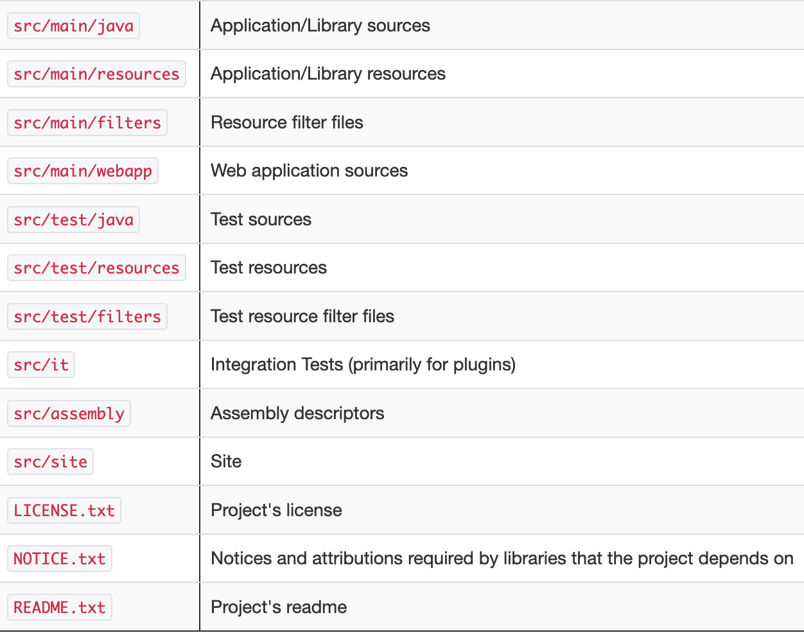

# Примитивные типы


# Описание структуры проекта Intelije


Это кастомизация самого IDE в виде конфигураций, настроек, промежуточные состояния. Все это сохранятеся здесь. 
Этот каталог не нужен, его можно добавлять в .gitignore

.iml - так же файл, в котором информация, которая нужна только для меня, можно не обавлять в гит.

[Рекомендации по организации файлов в проекте Maven](https://maven.apache.org/guides/introduction/introduction-to-the-standard-directory-layout.html)



super - разрешен для записи, но не предоставляет инфу
extends - разрешен для предоставления инфы, но запрещен для записи
Пример - получаем список для записи и записываем в него другйо список.
```Java
public static <T> void copy (List<? super T> dest, List<? extends T> src){} 
```

## Generics
__Основа__
Обобщения позволяют уйти от жесткого определения используемых типов.
T - заглушка для типа. называется Универсальным параметром, вместо него можно подставить любой тип.
При создании объекта указывается какйо тип будет исопльзоваться вместо T.
```Java
class Account<T> {
    private T id;
    private int sum;

    public Account(T id, int sum) {
        this.id = id;
        this.sum = sum;
    }

    public T getId() {
        return id;
    }

    public int getSum() {
        return sum;
    }

    public void setSum(int sum) {
        this.sum = sum;
    }
}

public class Generics {
    public static void main(String[] args) {
        Account tomAcc = new Account<Integer>(1, 100000);
        System.out.println(tomAcc.getId());
        System.out.println(tomAcc.getSum());

        Account mariAcc = new Account<String>("second", 10000);
        System.out.println(mariAcc.getId());
        System.out.println(mariAcc.getSum());
    }
}
```

__Обобщенные интерфейсы__
```Java
Можно сразу указывать тип, которым будет заменяться T, либо делать класс <T>.
interface PersonalAccount<T> {
    T getId();

    T getSum();

    void setSum(T newSum);
}

class MyPersonalAccount implements PersonalAccount<Integer> {

    int id;
    int sum;

    public MyPersonalAccount(int id, int sum) {
        this.id = id;
        this.sum = sum;
    }

    @Override
    public Integer getId() {
        return id;
    }

    @Override
    public Integer getSum() {
        return sum;
    }

    @Override
    public void setSum(Integer newSum) {
        sum = newSum;
    }
}

public class Example2 {
    public static void main(String[] args) {
        MyPersonalAccount myPersonalAccount = new MyPersonalAccount(1, 123);
        System.out.println(myPersonalAccount.getId());
        myPersonalAccount.setSum(123);
        System.out.println(myPersonalAccount.getSum());
    }
}
```

__Обобщенные методы__
```Java
class Printer {
    public static <T> void print(T[] items) {
        for (T item : items) System.out.println(item);
    }
}

public class Example3 {
    public static void main(String[] args) {
        Printer.print(
                new String[]{
                        "123123",
                        "1425354",
                        "lkdfjqwef",
                        "ajd;flaksjdf"
                }
        );
    }
}
```

__Обобщенные конструкторы__
```Java
class Account{
     
    private String id;
    private int sum;
     
    <T>Account(T id, int sum){
        this.id = id.toString();
        this.sum = sum;
    }
     
    public String getId() { return id; }
    public int getSum() { return sum; }
    public void setSum(int sum) { this.sum = sum; }
}
```

__Ограничение обобщений__
Для установки ограничения тавится слово __extends__
В данном случае в классе __Transaction__ можно заменить __T__ на класс __Account__, либо на любого его наследника.
```Java
class Account{}
class Transaction<T extends Account>{}
```
```Java
class BaseAccount {
    private int id;
    private int sum;

    public int getSum() {
        return sum;
    }

    public void setSum(int sum) {
        this.sum = sum;
    }

    public int getId() {
        return id;
    }

    public BaseAccount(int id, int sum) {
        this.id = id;
        this.sum = sum;
    }
}

class ClassicAccount extends BaseAccount {

    public ClassicAccount(int id, int sum) {
        super(id, sum);
    }
}

class Transaction<T extends BaseAccount> {
    private T from;
    private T to;
    private int sum;

    public Transaction(T from, T to, int sum) {
        this.from = from;
        this.to = to;
        this.sum = sum;
    }

    public void execute() {
        int newSum = from.getSum() - sum;
        from.setSum(newSum);

        newSum = to.getSum() + sum;
        to.setSum(newSum);
    }
}

public class Example4 {
    public static void main(String[] args) {
        ClassicAccount bob = new ClassicAccount(1, 10000);
        ClassicAccount mari = new ClassicAccount(2, 0);
        System.out.println(bob.getSum());
        System.out.println(mari.getSum());

        Transaction sendMoney = new Transaction<>(bob, mari, 10000);
        sendMoney.execute();
        System.out.println(bob.getSum());
        System.out.println(mari.getSum());
    }
}
```

## Java Collections Framework
Набор связных классов и интерфейсов, реализующих commonly reusable collections структур данных.
То есть это набор классов и интерфейсов, в которых реализовано хранение объектов.
Есть небольшая конвенция по испльзованию. Советуется при создании любого "массива" ссылаться на интерфейс, который этот класс "массив" реализует.
```Java
List<Integer> arrayList = new ArrayList<>();
```
Это нужно, если вдруг нам понадобится много удалять, то лучше исопльзовать LinkedList, тогда можно сделать так
```Java
List<Integer list = new ArrayList<>();
list = new LinkedList<>(list);
```
Это не очень полезно, но можно

__Структура интерфейсов и классов Collections__


__List__
__ArrayList__ - позволяет добавлять столько данных, сколько есть памяти на ЭВМ.
Все объекты класса ArrayList использует внутренний массив. Когда кол-во элементов становитс ябольше, просто создаетс яновый массив и объекты старого копируются в новый, а новый в 2 раз больше.
По этой причине метод Remove малоэффективен, если удаление идет в середине массива или в начале.
[1,2,3,4,5] <- Если удалять 5, то он просто удаляет 5 и сокращает размер массива, но если удалить 3, то сначала удаляется 3, затем все элементы после 3 переносятся на 1 шаг влево, затем сокращается размер массива.
Для решения этой проблемы есть __LinkedList__.

Использовать когда: 
1) Много добавлений в конец листа
2) Много считываний (get) по индексу

__LinkedList__
Двусвязный список
Реализует интерфейс List, но иначе, чем Array.
head -> [0] -> [1] -> [2]
Если мы добавим элемент в начало листа либо, то просто в head укажется ссылка на новый элемент, а в новом элементе на элемент [0]
head <-> [new] <-> [0] <-> [1] <-> [2]
Так же если удалять элемент, то мы просто меняем ссылки.
но если нужно поулчить элемент по индексу, то это будет очень медленно, так как нужно будет прйоти по всей цепочке элементов.
Так же, если добавлять элемент в конец листа, придется дойти до последнего элемента и присвоить ему ссылку на следующий элемент, для этих задач лучше __ArrayList__
LinkedList лучше всего использовать, если много приходится удалять.

Исопльзовать когда:
1) Много удалений
2) Много добавлений в начало

__Map__
Map - от слова отображение. Отображение множеств - это правило, которое каждому элементу множества A ставит в соответствие один и только один элемент множества B.

__HashMap__
```Java
Map<Integer, Integer> map = new HashMap<>();
```
Если убрать <> в new HashMap(); то внутри будут объекты класса Object, а не HashMap.
В java key и value не рассматриваются отдельно, вместе они составляют __Map.Entry<K, V>__
В HashMap элемены не имеют никакого порядка, он это не гарантирует. Можно задать объекты в одном порядке
1 - один
2 - два, но со следующим запуском было 2 - два, 1 - один.
Это происходит из-за того, что исопльзуется хэширование, оно зависит от случайных величин.
То есть HashMap нужно использовать тогда, когда не важен порядок внутри Map.
__LinkedHashMap__
Сохраняет порядок добавления пар.
__TreeMap__
Сортирует пары ключ значение по ключу.

__Set__
set - множество. Коллекция, которая хранит в себе уникальные элементы.
__HashSet__
Обычное множество уникальных элементов, не гарантирует порядок.
__LinkedHashSet__
Множество уникальных элементов, гарантирует порядок.
__TreeSet__ 
Множество уникальных элементов, сортирует.

__Методы hashcode, equals__
В данном случае Из-за того, что класс Person не содержит методов hashCode() и Equals() - они не могут быть сравнены мжеду собой и поэтому для компа это одинаковые объекты. 
А любой объект класса Object (и его наследники) - содержит эти методы, поэтому 2 одинаковых значения не пройдут.
За счет этих методов комп понимает, что это разные объекты.
```Java
     Set<Person> personSet = new HashSet<>();

        personSet.add(new Person(1, "Mike"));
        personSet.add(new Person(1, "Mike"));

        System.out.println(personSet);
        //[Person{id=1, name='Mike'}, Person{id=1, name='Mike'}]


        Set<String> stringSet = new HashSet<>();

        stringSet.add("MyString");
        stringSet.add("MyString");

        System.out.println(stringSet);
        //[MyString]


class Person {
    private int id;
    private String name;

    public Person(int id, String name) {
        this.id = id;
        this.name = name;
    }

    @Override
    public String toString() {
        return "Person{" +
                "id=" + id +
                ", name='" + name + '\'' +
                '}';
    }
}
```
После автоматической генерации этих методов, объекты можно будет сравнивать между собой по хэш коду и с помощью метода equals.
__Контракт HashCode и Equals__
Почему нужно 2 метода для сравнения?
Потому что используя эти 2 методы мы сравниваем объекты наиболее быстрым образом. И при этом иногда метод hashCode выдает неправильные результаты, поэтому 2-й метод нужен еще и для допроверки.

Хэширование - преобразование массива входных данных __произвольной длины в__ выходную битовую __строку фиксированной длины__, выполняемое поределенным алгоритмом. Функция называется - хэш-функция.

Колличество хэш-ключей ограничино, так как всегда ограниченное кол-во комбинаций, которые сгенерируются хэш-функцией. А кол-во комбинаций объектов - бесконечное множество.

Алгоритм проверки 
1. Вызываем hashCode() у двух объектов и сравниваем, если они не равны, то объекты 100% разные, если равны, то
2. вызываем метод Equals и проверям уже поля объектов, чтобы допроверить одинаковость объектов.


__HashMap__
Как работает данная коллекция.
Хэширование в этом классе позволяет ускорить работу коллекции.

Реализация класса hashMap

Когда мы хотим положить объект внутрь отображения, то сначала генерируется хэш код, но он может быть очень большим, поэтому в данном случае сначала хэш код побитово умножаем на n-1, что дает гарантию, что после этого умножения число будет между 0 и 15, так как n = 16.

Если вдруг после расчетов индекс совпал, то мы просто добавляем этот элемент в конец связного списка (это очень быстро, просто добавляем ссылку на новый элемент)

Получение объекта тоже делается через расчет индекса. В этомпреимущество, мы не пробегаем по массиву, а просто расчитываем ячейку внутреннего массива и берем от туда элемент.


__Comparator__
Сортировка внутри классов, поддерживающих сохранение порядка элепментов.
List, TreeSet, TreeMap и т.д.
Comparator - класс, который является Сравнивателем.
Comparable - говорит, что данный класс может сравниваться друг с другом.

__Queue__
Очередь. FIFO. Первый вошел, первый вышел. (обычная живая очередь)
Если много потоков обращаются к одному ресурсу, то целесообразнее выстраивать эти потоки в очередь.
__ArrayBlockingQueue__ - позволяет задавать кол-во элементов в очереди.
(Throws exception) | (Returns special value)
Insert: add(e) | offer(e)
Remove: remove() | poll()
Examine: element() | peek()

Если в очередь, с максимальным кол-вом элементов 2, добавить 3 элемента, то add - вернет исключение, а offer - тихо вернет специальный тип, например Boolean (false)

__Stack__
LIFO. Посследний зашел, первый вышел. Похоже на очередь проверки тетрадей учетелем. Ученики сдают тетради и тот, кто сдал ее последним кладет ее на верх, учитель потом проверяет, беря тетради сверху.
push() - Добавляет элемент.
pop() - Достате из очереди и удаляет.
peek() - Достает элемент, но не удаляет.

## Многопоточность
Конспект курса продвинутая Java

Изначально потоки в java никак не синхронизированны.
В классе потока (extends Thread), нужно переопределить метод __run()__, в котором будет код, который бдуте выполняться в этом потоке.
Метод __start()__ запускает поток (то, что находится в методе __run()__).
С помощью метода __sleep()__ можно усыпить поток на заданное кол-во милисекунд.

Создать поток можно не только через extends Thread, но и используя интерфейс __implements Runnable__
Этот способ получше, так как он чище, в нем нужно реализовывать только 1 метод Run.

__Синхронизация потоков__
__Ключевое слово volatile__ - необходимо, когда одна переменная делится между несколькими потоками. И когда один поток пишет в эту переменную, а другой поток читает.
Если переменная указана без этого ключевого слова, то есть вероятность ошибки. Неправильная запись данных в перменную.
Это происходит из-за плохой когерентности кэша.
С этим словом переменные нее будут кэшироваться, а будут браться из общей памяти.

Есть двухъядерный процессор. У каждого ядра есть свой кэш (участок памяти, в котором хранятс янаиболее свежие и важные данные) это очень быстрая память. Ядро процессора напрямую общается со своим кэшем и в кэш попадают только самые важные данные.
И если один поток закэширует данные переменной себе в кэш и другой поток тоже, но уже другие данные, то может произойти ошибка.
Например поток 1 изменит эту переменную, но другое ядро будет продолжать читать переменную из своего кэша.


__Ключеваое слово synchronized__- Нужно. когда 2 или более потоков пишут в одну переменную.
В примере 2 потока стараются успеть положить свою порцию данных и поэтому возникает Raace condition. Два потока пишут одновременно в одну переменную и часть инструкций теряется.
В данном случае это происходит потому что 
counter = counter + 1. Сначала берется старое значение counter, затем прибавляется единица. То есть эта операция не атомарная - не простая, выполняется несколько операций.
ПОэтому пока воторой уже прибавил 10 раз единицу, первый тупит, а потом присваивает каунтеру значение, которое запомнил, пока тупил, а не берет новое.
Вот это ключевое слово синхронизирует эти потоки, чтобы такой проблемы не было.

Он работает таким образоми, что допускает к методу (synchronized void increment()) только один поток. 
В java каджому объекту присваивается монитор. и эта сущность в один момент времени может быть только у одгого потока. вот это ключевое слово исопльзует эту логику. Поток занимает монитор, другой поток ждет, пока монитор освободится.

Синхронизация происходит на каком-то объекте. в данном примере MyNumber myNumber = new MyNumber(); так как мы не указали явно на каком объекте происходит синхронизация. по умолчанию this = myNumber.

Для синхронизации отдельных сущностей принято создавать Lock объекты. Это может быть любой объект, хоть ArrayList или класс, так как у каждого объекта есть свой монитор. В данном случае просто удобнее исопльзовать самый базовый класс.
```Java
Object lock1 = new Object();
```

__Thread pool__
Метод создания потоков. Он работает так же, но иногда может быть удобнее.
Executors - класс, который содержит в себе статические методы, которые принимают на вход аргументы и возвращают ExecutorServices.
ExecutorService - можно воспринимать как работников, которым можно даватьк акую-то работу и они будут ее делать.
В данном примере создается пул из двух потоков.
```Java
ExecutorService executorService = Executors.newFixedThreadPool(2); 
```
submit - передает задание.
shutDown - прекращает прием заданий.

Следующий метод awaitTermination() - "ожидание окончания", в котором нужно указать сколько мы готовы ждать, пока наши потоки не выполнят задания.
Например 1 день.
```Java
executorService.awaitTermination(1, TimeUnit.DAYS);
```

__Wait(), Notify()__
Эти два метода определены у любого объекта в java.

wait(): освобождает монитор и переводит вызывающий поток в состояние ожидания до тех пор, пока другой поток не вызовет метод notify()
notify(): продолжает работу потока, у которого ранее был вызван метод wait()
notifyAll(): возобновляет работу всех потоков, у которых ранее был вызван метод wait()

notify - нее освобождает монитор.

__Паттерн Producer - Consumer__
"Производитель - потребитель". Часто встерчается в многопоточке. Часто бывает ситуация, где несколько потоков производят что-то, а другие потоки потребляют.
Этот паттерн можно реализовать с помощью ArrayBlockingQueue - чаще всего придется использовать именно его в многопоточке, в нем дохрена полезного. Этот класс по умолчанию синхронизированн.
В примере produce() - производит элементы (добавляет в массив рандомные числа), а consume() - использует эти элементы (достает их из массива).

__CountDownLatch__
Обратный отсчет до момента, когда защелка схлопнется.
countDown() - метод, который декрементирует на 1 единицу.
При создании CountDownLatch мы указываем число, это число указывает сколько раз нужно вызвать метод countDown() из любого кол-ва потоков, чтобы await перестал ждать.

## Многопоточность Java
java.util.concurrent.* -  - библиотека потокобезопасных методов и классов
__Процесс и поток (Thread)_ - Это совокупность кода и данных, разделяющих общее виртуальное адрессное пространство.

При помощи процессов выполнение разных программ изолированно друг от друга: каждое приложение использует свою область памяти, не мешая другим программам.


Под процесс выделяется стековая память при запуске, по мере работы процесса он потребляет память из кучи.
Процесс не может влезть в память другого процесса их память изолирвоанна. 
За изолированность отвечает операционная система.
При запуске прцоесса запускается основной поток данного процесса Main thread. 
Когда мы входим в main - точка входа в программу - запускается основной поток. Процесс не может работать без основного потока.
В рамках одного процесса может быть запущено много потоков, которые как раз и помогают распаралеливать задачи.

Потоки - если у нас 4 ядра процессора и 4 потока, то они реально физически работуют параллельно, но если у нас 30 потоков, то 4 ядра не могут распараллелить их, поэтому появляется термин Псевдопараллельность.
Операционная система (sheduler модуль) поочередно дает управление каждому потоку.

В большинстве случаев имеет место всевдопараллельность.

Как создать поток и запустить его.
1. Нужно переопределить класс Thread
2. Затем где это нужно запустить его thread.start();
Другой вариант:
1. Использовать интерфейс Runnable
2. и через функцию run() запустить его.

С помощью Sleep можно заморозить процесс на некоторое время

С помощью join можно подождать завершение другого потока.


__Монитор__ - для целей синхронизации между потоками Java использует некий механизм, который назвается монитор.
С каждым объектом ассоциирован некоторый монитор, а потоки могут его заблогировать "lock" или разблокировать "unlock"


__Жизненный цикл потоков__


__Многопоточность из Философия java__
__Общее описание__
Параллельность часто повышает производительность программ, выполняющихся на _одном_ процесоре. Так как:
__Block__ - Ситуация, при которой одна задача в программе не может продолжать выполнение из-за каких-то условий, неподконтрольных программе (обычно ввод-вывод), эта задача или программный поток _блокируется_. Однако, если программа написано с учетом параллельности, то во время блока одной задачи другие могут продолжать выполняться, программа не будет простаивать.

С точки зрения производительности на однопроцессорной машине имеет смысл делать параллельность, если некоторые задачи могут блокироваться.

Один из простейших механизмов реализации параллельности - _процессы_ уровня операционной системы.
__Процесс__ - представляет собой самостоятельную программу, выполняемую в собственном адрессном пространстве. Многозадачная операционная система может одновременно выполнять боле еодного процесса, переключая процессор между процессами (сначала одному процессу уделит вермя. потом другому, в итоге все процессы двигаются равномерно и можно скзаать "параллельно" друг другу)

Система обычно изолирует процессы друг от друга, чтобы они не мешались. Но параллельные системы, совместно используют ресурсы - память, ввод и вывод, поэтому основные трудности при написании многопоточных программ связаны с координацией использования ресурсов между задачами разных потоков, чтобы в любой момент времени ресурс был доступен только для одной задачи.

Пример:
Сохранение одного файла в разные места. 
Однопоточный ввариант - файл последовательно сохраняется на каждый носитель, сохранение на последующий носитель не возможно, пока текущий в работе.
Многопоточный вариант - все процессы примерно одновременно действуют, а значит сохранение значительно ускоряется.

В Java используется потоковая модель с _вытеснением_, при которой механизм планирования выделяет временные _кванты_ каждому потоку, переодически прерывая его выполнение и осуществляя переключение  контекста на другой поток так, чтобы кжадому потоку выделялось разумное время на выполнение его задачи.
в _кооперативной многопоточной системе_ каждая задача добровольно уступает управление, для чего программист должен сознательно вставить в кжадую задачу соотвествующую команду.

Кооперативная система имеет 2 преимущества над _вытеснительной_:
1. Переключение контекстаобычно требует существенно меньше затрат
2. Количество одновременно выполняемых независимых задач теоретически не ограничивается
Но некоторые кооперативные системы не предусматривают распределение задач между процессорами и это сущесвтенное ограничение.

__Основы построения многопоточных программ__
Параллельное программирование позволяет делить программу на несколько независимых частей (в несколько отдельных, самостоятельно выполняющихся подзадач). Каждая такая задача называется __Thread - поток__
__Поток__ - это выполняемая параллельно в рамках процесса последовательность команд программы.
Процессор вмешивается в происходящее и выделяет каждому потоку некоторый отрезок времении (квант).
Каждый поток полагает, что он исопльзует процессор монопольно, но на деле время процессора распределяется между ними всеми.
(Кроме случаев, если эвм содержит несколько процессоров, тогда 1 поток на 1 процессор)

# Коллекции объектов
java.util.* содержит большой набор классов контейнеров, наиболее важные:
List, Set, Queue, Map.
Все они могут изменяться в размерах. Таким образом, в отличие от массивов, в классы контейнеров можно поместить любое кол-во объектов, не беспокоясь о размерах во время написания программы.
В Java SE5 приходилось следиь за тем. тобы в контейнер не помещались разные типы. Поэтому если не использовать дженерики. то можно сунуть в лист разные объекты. Это явно показано в примере __ApplesAndOrangeWithoutGenerics__
@SuppressWarnings("unchecked") - Эта аннотация используется для подавления предупреждений. unchecked - означает, что подавляться должны только "непроверяемые" предупреждения.
Поэтому стоит исопльзовать ArrayList<Apple> myList = new ArrayList(), вместо ArrayList myList = new ArrayList(). Это предотвращает помещение неверного типа объекта в контейнер на стадии компиляции.
Так же при выборке данных из List преобразованиее типа становится лишним, таким образом с помощью обобщений код стал проще.
В контейнер <Apple> так же можно поместить любой подтип класса Apple.

В идеале код должен взаимодействовать с интерфейсами, но это не всегда возиожно. То есть посредсством восходящего преобразования. Такое решение не вссегда работает, так как у класса LinkedList есть методы, которые остутствуют в интерфейсе List. TreeMap содержит методы. не входящие в Map.
List<Apple> apples = ArraList<Apple>();
List<Apple> apples = LinkedList<Apple>();

__Коллекция (Collection)__ - последовательность отдельных элементов, формируемая по некоторым правилам
- List - хранит в определенной последовательности.
- Set - в нем нельзя хранить повторяющиеся элементы.
- Queue - выдает элементы в порядке, поределяемом дисциплиной очереди (LIFO, FIFO).

__Карта (map)__ - набор пар объектов <ключ - значение>, с возможность ювыборки значения по ключу.

Интерфейс Collection обобщает концепцию последовательности. См. пример __CollectionCreateExample__. Подойдет любой объект любого класса, производного от Collection. 
add() - в документации Collection - убеждается, что в Collection присутствует заданный элемент. Точнее Убеждается, что у нас есть возможность добавить этот эелемнтв коллекцию и новый элемент не будет дубликатом.
Эта формулировка подразумевает функциональность множества Set, для которого элемент добавляется только в том случае, если он еще не присутствует в контейнере. 
Для любой разновидности List, вызов add() всегда эквиваелнтен - добавлению.
То есть add вернет false, если такой объект уже есть и у нас нет возможностии добавить дубликат в эту коллекцию. Если этого объекта нет, то вернет true и добавит объект.

Collection<Integer> myCollection = new LinkedHashSet<>(20);
Collection<Integer> myCollection2 = new HashSet<>(20);
Collection<Integer> myCollection3 = new TreeSet<>();

__Добавление групп элементов__
В java.util определены вспомогательные методы для добавления групп элементов в Collection.
* Arrays.asList() - получает массив или список элементов, разделенных запятыми, который преобразуется в List фиксированного размера.
После такой конструкции нельзя изменять размер базового массива, поэтому .add() или delete() или любое другое изменение размера выдаст ошибку RunTimeException
Проблема __asList()__ так жее заключается в том. что он пытается "угадать" итоговый тип List, не обращая внимания на присвоенные значения. Во избежания проблем, лучше явно указывать тип.
```Java
List<Integer> myLinkedList = new LinkedList<>(Arrays.<Integer>asList(2, 5, 1, 3, 4));

List<Integer> list = Arrays.asList(1, 2, 3, 4, 5); 
// list.add(21); Ошибка - нельзя изменить размер базового массива.
```
* addAll() - получает объект Collection и либо массив, либо список, разделенный запятыми и добавляет элементы в Collection.
__addAll()__ - предпочтительнее, так как быстрее и это более простая конструкция.

__Вывод__
У Collections есть свои методы toString(), поэтому кака с массивами никаких подручных средств не нужно.
```Java
Arrays.toString();
```

__List__
Контейнер List добавляет к методам Collection методы вставки, удаления элементов в середине списка. Гарантирует хранение элементов в определенной последовательности.

2 основные разновидности List:
- ArrayList - базовый контейнер, на базе обычного массива, поэтому быстрый произвольный доступ, но медленное изменение.
- LinkedList - Двусвязный список - оптимальный последовательный доступ, быстрая вставка, ужасный произвольный доступ, но больше функциональности.

Методы:
- subList(start index, end index) - берет указанный интервал.
- retainAll() - пересечение множеств
- containsAll() - проверяет наличие

__Итераторы__
__Iterator__ - Это один из паттернов проектирования. Итераторо мназывается объект, обеспечивающий перемещение по последовательности объектов с выбором каждого оъекта этой последовательности. При этом пользователю не нужно заботиться о лежащей в ее основе структуре. Обычно итератор является - легковесным объектом - его создание не должно занимать много ресурсов.
Для этого его ограничивают некоторыми условиями, например в Java - итератор может перемещаться только в одно мнаправлении.

Операции:
- iterator() - запрос у Collection итератора. Этот итератор готов вернуть начальный элемент последовательности.
- next() - получить следующий элемент последовательности.
- hasNexxt() - проверить, есть ли следующий элемент в последовательности?
- remove() - удалить из последовательности последний элемент, возвращенный итератором.

__ListIterator__ - Это более мощная разновидность Iterator, которая работает только с List. ListIterator может перемещаться и вперед и назад, в отличие от Iterator. А так же может заменить последний посещенный элемент методом set().
Если создать этот итератор с помощью ListIterator(n), то он будет сразу на этой позиции.

__LinkedList__
Как и ArrayList - расширяет базовый функционал List. 

__Стек Stack__
Обычная очередь - Last In First Out. (стопка тетрадей на проверку).
LinkedList -  в целом содержит методы, которые реализуют функциональность стека, поэтмоу можно просто его исопльзовать и не создавать отдельный класс-стек. 

__Множество Set__
Хранит только уникальные элементы каждого объекта. Чаще всего Set используют для тестирования принадлежности, чтобы пользователь мог легко узнать, присутсвует ли объект в множестве.
Чаще всего выбирают реализацию HashSet, которая очень быстрая для поиска по ключу.

__HashSet__ использует для быстрого хранения и поиска - хэширование.
__TreeSet__ исопльзует красно-черное дерево и хранит все в определенном порядке. (Сразу отсортирует). Для сортировки использует лексико-графическую сортировку, можно передать любой другой компаратор, для изменения типа сортирвоки. Например __String.CASE_INSENSITIVE_ORDER__.
__LinkedHashSet__ использует хэширование, но элементы сохраняются в связнои списке в порядке вставки.

Самый популярный метод для Set - __contains__ и __containsAll__ - проверка на наличие.

# Регулярные выражения Regexp
Помогает работать со строками.
Лучше смотри пример Regexp в проекте JavaSandbox

В Java есть 2 класса, которые расширяют работу с регулярными выражениями:
__Pattern__ - этот класс представляет само регулярное выражение, написанный паттерн помещается в этот класс.
__Matcher__ - этот класс исопльзует класс паттерн, для проведения операций над текстом.

У Pattern класса приватный конструктор, поэтому нужно исопьзовать метод __compile()__ для создания класса. Pattern email = Pattern.compile("");
в Matcher передаем заттерн и делаем на нем метод __matcher()__, в качесвте аргумента передаем текст, который надо обработать.
Matcher emailMatcher = email.matcher(text);

find() - возвращает true, если нашел результат.
group() - группирует то, что нашел. В качесвте аргумента принимает id группы.
Pattern email = Pattern.compile("\\w+@(gmail|yandex)\\.(com|ru)");
В данном паттерне группа 1 = (gmail|yandex), группа 2 = (com|ru);
Если указать group(1); То выведется ТОЛЬКО группа 1, остальные символы в выводе будут игнориться. Чтобы сделать группу, нужно просто заключить регулярное выражение в скобку и это будет группа.
 while (emailMatcher.find()){
            System.out.println(emailMatcher.group());
        }
    
# Лямбда выражения
() -> {}
() - аргументы
{} - тело
Это синтаксический ссахар, который делает проще передачу кода в метод, без использования анонимных класссов.
Так же ее называют анонимной функцией. Функция, которая определена без привязки к идентификатору.
Вместо того, чтобы создавать новый объект Runnable, мы сразу реализуем интерфейс Runnable, а именно метод run();
То есть все анонимные классы можно поменять на лямбда выражения.
```Java
Thread myThread1 = new Thread(new Runnable() {
    @Override
    public void run() {
        System.out.println("do some");
    }
});
     
Thread myThread2 = new Thread(() -> {
    System.out.println("do some");
});
```

## Операции над коллекциями
смотри LambdaExpressionExample3 в проекте Javasandbox

 # Maven
__Сборка проекта и управление зависимостями__
Проекты можно собирать в один файл, который будет запускаться на других компьютерах.
.jar - обычное приложение
.war - веб приложение

Терминология:
- artifact - библиотека, готовый проект. Можно подключить к своему проекту.
- зависимость - сторонняя библиотека.
- Apache Maven - инструмент для сборки проекта и управления зависимостями.

У Maven есть своя структура папок.
И можно создать проект, основываясь на каком-то архитипе, который по умолчанию выстраивает правильную структуру папок.

Groupid - уникальное поле, которое что-то означает. Весь код будет лежать по этоу пути, например maven.example.com
Artifactid - название артифакта (проекта), например testProject
Version - версия проекта

Для добавления зависимостей, можно зайти в mavenrepository и та мнайти нужную зависимость в виде XML.

# Тестирование
Test case - тестовый сценарий - сценарий, описывающий совокупность шагов, конкретных условий и параметров, необходимых для проверки реализации тестируемой функции или её части.
Это структура вида:
Action > Expected Result > Test Result.

Уровни тестирования:
- Модульное (unit)
    Проверка работы программы на уровне отдельных модулей (классов, методов)
- Интегрированное
    проверка совместной работы нескольких модулей
- Системное
    проверка работы системы в целом

Assert - (утверждение) сопоставление ожидаемого результата с фактическим
Assert Exception - ошибка при проваленном тесте

Зачем нужны модульные тесты?
- Разработчик создает методы и классы для конкретных целей
- Снижается число новых шибок при добавлении новой функциональности
- Тест отражает элементы технического задания, некорректное завершение теста сообщает о нарушении требований заказчика.

## Junit
библиотека для тестирования в java
1. Каждый тестовый сценарий (test case) - отдельный метод.
Методы необходимы помечать аннотацией @Test
2. Вспомогательные методы с аннотациями:
@Before, @BeforeClass, @After, @AfterClass
3. Тест необходимо называть с суффиксом Test (пример Vector2DTest)
4. Тестовые методы желательно должны содержать "should" в названии (sumShouldBePositive)

## @Test
Все тестовые методы обязательно должны быть public void
у аннотации @Test могут быть доп. параметры:
- expected - код в тесте проверяется на генерацию определенного исключения
- timeout - код в тесте должен работать не более указанного времени (иначе завален)

## org.junit.Assert
Этот класс нужен для сопоставления ожидаемого результата с реальным.
Методы:
- assertTrue()
- assertFalse()
- assertEquals()
- assertArrayEquals()
- assertNotEquals()
- assertSame()
- assertNotSame()
- fail() - гарантированное падение теста.

## Аннотации и вспомогательные методы
@ignore - тест с этой аннотацией не выполняется. Лучше не использовать. так как можно забыть про него.
Вместо Assert можно исопльзовать Assume. Разница в том, что если првоерка верна - тест пройдет, если проверка неверна - тест игнорируется.

@BeforeClass - запускается только один раз при запуске теста
@Before - запускается перед каждым тестовым методом.
@After - запускается после каждого метода.
@AfterClass - запускается после того, как отработали все тестовые методы.

## Жизненный цикл тестируещего класса
1) @BeforeClass - один раз для кжадого класса
2) Для каждого @Test-метода созадется экземпляр тестового класса
3) @Before
4) @Test
5) @After
6) @AfterClass - один раз для кжадого класса

## Подробнее об Java аннотациях
Специальный тип комментарием в коде, с помощью которого можно:
- передавать инструкции для Java компилятора
- передавать инструкции для анализаторов исходного кода
- передавать метаданные, которыее могут быть исопльзованы Java приложением, либо другими приложениями или фреймворками (Spring)

```Java
public @interface MyExampleAnnotation {}
```

Встроенные аннотации
- @Override - переопределениеи метода
- @Deprecated - означает, что метод устарел и его лучше не использовать.
- @SuppressWarnings - нужна, чтобы подавлять предупреждения. Предупреждения не будут генерироваться.

## Создание аннотаций
У аннотаций есть default значения.

У аннотаций есть свои аннотации
- @Target - указывает к чему может быть применена аннотация. Значения берутся из перечисления (enum) ElementType (из того же пакета).
FIELD - поле
METHOD - метод
TYPE - класс, интерфейс, перечисление

- @Retention - политика удержания аннотации (до какого этапа компилирования или выполнения аннотация видна). Значения лежат в перечислении RetentionPolicy:
- Source - отбрасывают при компиляции. Видны только в самом исходном коде
- Class - сохраняются в байт-коде. но недоступны во время работы программы
- Runtime - сохраняются в байт-коде и доуступны во время работы программы

```Java
public @interface MyAuthor {
    String name() default "Unnamed";
    int dateOfBirth() default 0;
}

@MyAuthor(name = "name", dateOfBirth = 12)
    public static void main(String[] args) {
        
}
```

## Java reflections
Рефлексия - это осознание объектом самого себя. (так будет легче понять концепцию.)
У каждого класса есть:
- Имя пакета
- Наименование класса
- Кол-во полей
- Кол-во методов
и т.д.

Ко всему этому можно обращаться отдельно. Так как каждый производный class наследуется от класса Class.
Обращаться к нему можно несколькими способами:

```Java
Class c = MyClass.class;

MyClass obj = new MyClass();
Class c = obj.getClass

Class c = Class.forName("ru.name.MyClass");
```