# Классификация сетей
* Тип коммутации
    1. __Коммутация каналов__. В данном случае перед тем как начать передачу данных, необходиму создать соединение между отправителем и получателем, посредством узлов. Затем все данные идут по установленному соединению. Если узел, через который происходит соединение выходит из строя, все соединение выходит из строя. Подобная комутация используется в телефонной сети.
    В данном случае не приходится решать __задачу маршрутизации__ так как все данные идут по одному и тому же пути.
    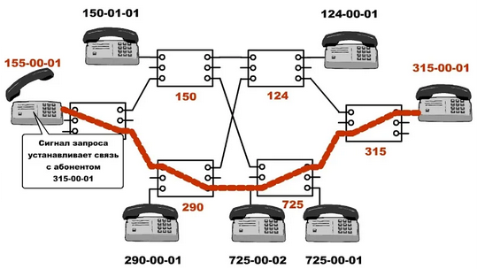
     

    2. __Коммутация пакетов__. Данные делятся на отдельные части - пакеты, которые передаются отдельно, независимо друг от друга и могут идти по разным узлам. Преимуществом является - отказоустойчивость. Если выйдет из строя один из узлов, можно будет найти другой узел и передать через него. Подобная комутация используется в компьютерных сетях.
    Когда пакет достигает какого-то узла, нужно решить __задачу маршрутизации__ - уда дальше отправлять пакет? Эта задача должна решаться для каждого пакета отдельно на каждом промежуточном устройстве. Это создает вычислительную нагрузку.
    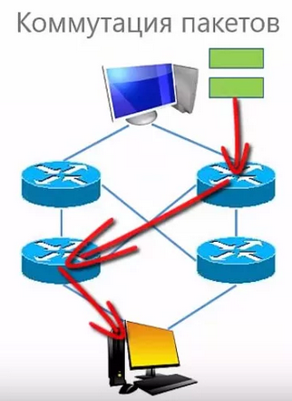
     

* Технология передачи данных
    1. __Широковещательные сети (broadcast network)__. В данном случае любые данные, которые передаются в сеть - доступны другим пользователем сети.
    
    2. __Точка-точка__. В данном случае данные передаются от компьютера к компьютеру. Иногда приходится передаватьданные через несколько связных между собой узлов.
    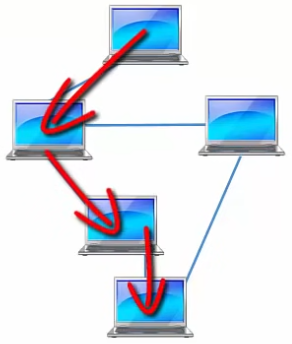
     

* Протяженность сети
    1. __Персональные__
    2. __Локальные__
    3. __Муниципальные__
    4. __Глобальная__
    5. __Объединение сетей__
    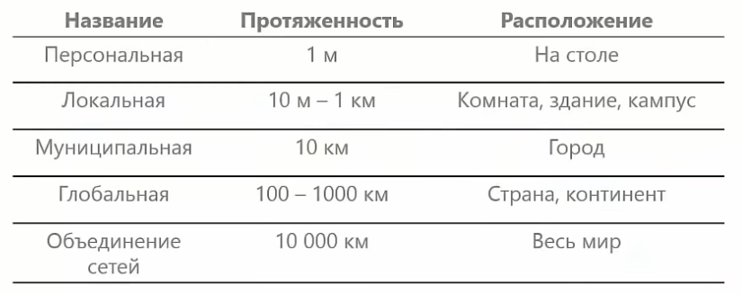
 

# Топология компьютерных сетей.
__Топология__ - это способ соединения компьютеров между собой в сеть. Это __Граф__, в котором __вершины__ - узлы сети (компьютеры и сетевое оборудование), а __ребра__ - связи между узлами (физические или информационные)
__Физическая топология__ - соединение устройств в сети.
__Логическая топология__ - правила распространения сигналов в сети.

Например __классический Ethernet__ имеет __физическую топологию__ звезда__, все устройства подключаются к одному устройству.
А __логическая топология__ - общая шина. Потому что устройство, передает данные поступившие в один порт, во все остальные порты.
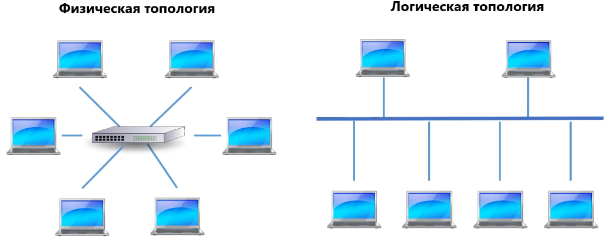
 

__Коммутируемый Ethernet__ так же испльзует физическую топологию __звезда__, но внутри комутатор обеспечивает логическую топологию __полной связи__, где каждый компьютер может быть соединен с другим компьютером напрямую.
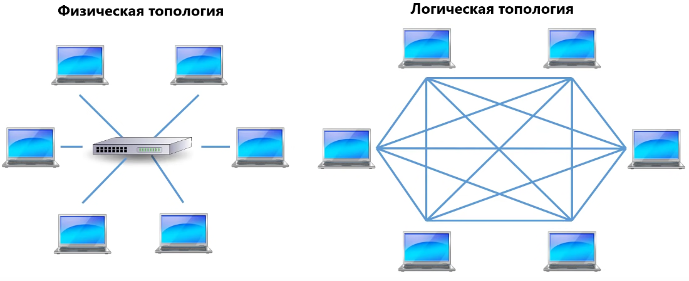
 

В случае с __Wi-Fi__ вообще нет физической топологии, так как устройства подключаются дистанционно. А логическая топология __общая шина__. Все, что компьютер передает через радиоэфир могут принять все компьютеры, которые находятся в зоне действия педедатчика.
 

1. __Полносвязная топология__. Это такая топология. в которой каждое устройство связано со всеми устройствами. Плюсы такой топологии в том, что данные можно передавать с любого компьютера другому напрямую. Недостаток - нужно много соединений и сетевых адаптеров. Если сеть содержит дохуя компьютеров, то такая сеть просто невозможна.
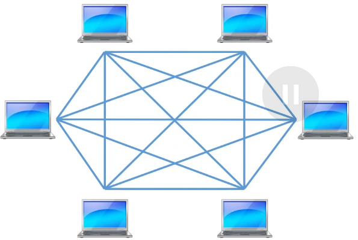
 

2. __Ячеистая топология__. Это как полносзвязная топология, но из которой удалены некоторые соединения.
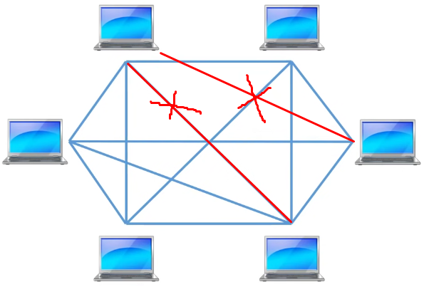
 

3. __Звезда__. В данном случае устройства подключаются не напрямую друг к другу, а к центральному устройству. Передача данных выполняется с помощью этого устройства. В качестве устройства используется сетевое устройство: комутатор, концентратор, точко доступа wifi, маршрутизатор.
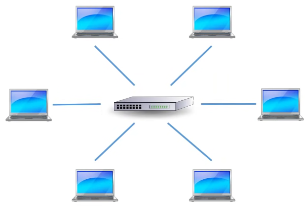
 

4. __Кольцо__. В данном случае передача данных выполняется по кольцу.
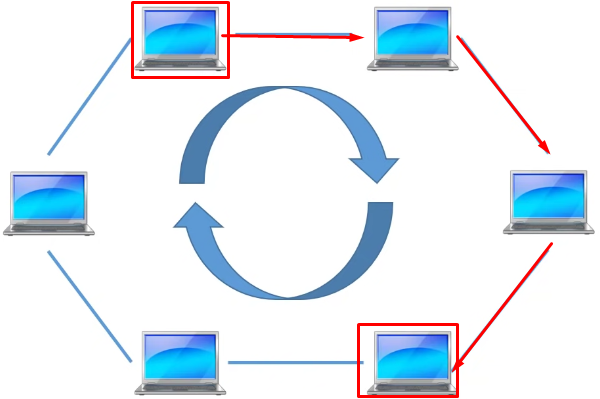
 

5. __Дерево__. В данном случае сетевое оборудование и компьютеры образуют древовидную структуру. Передача файлов происходит через несклько промежуточных узлов.
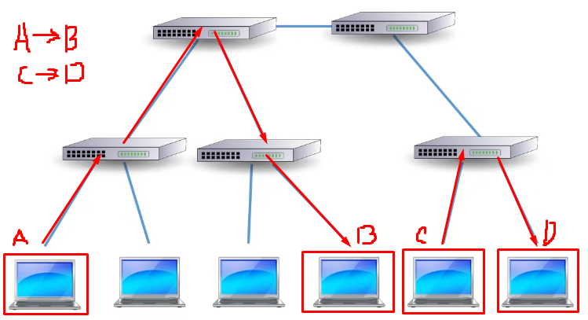
 

6. __Общая шина__. Все компьютеры в сети подключены к некоторой среде. В простом случае - это обычный медный кабель, который идет вдоль всех компьютеров. Данные, которые передаются в эту среду передаются всем компьютерам.
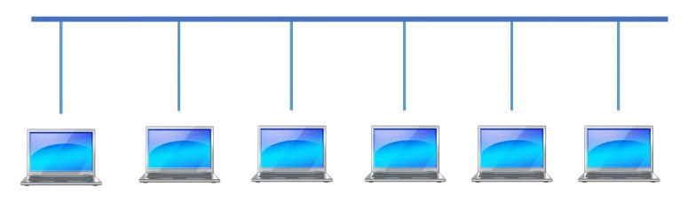

7. __Смешанная топология__. Обычнов крупной сети исопльзуется смешанная топология.
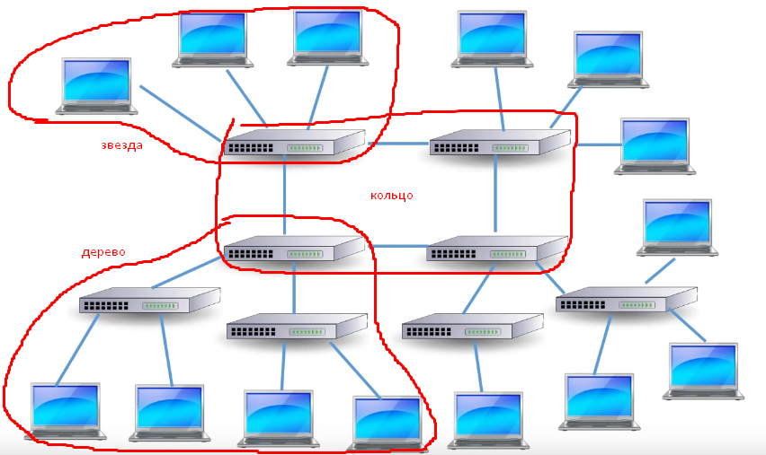

# Стандарты компьютерных сетей.
__de jure__ (формальные, юридические) - стандарты, принятые по формальным законам стандатизации.
__de facto__ (фактические) - стандарты, установившиеся сами собой.

__ISO__ (Международная организация по стандартам) - эталонная модель взаимодействия открытых сетей.

__IEEE__ (Институт инжетнеров по электронике и электротехнике) - технология передачи данных.
Разработкой разных стандартов занимаются разные коммитеты, вот их номера:
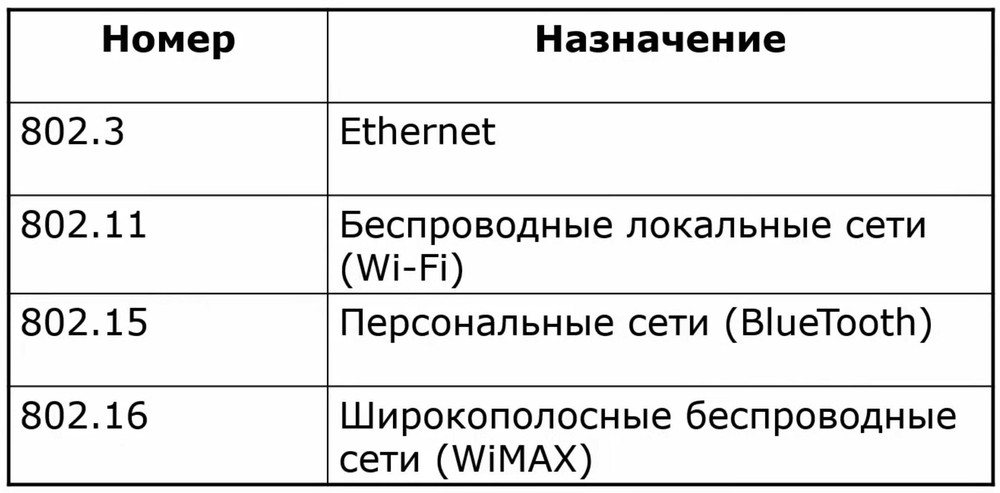

__IAB__ (Совет по архитектуре интеренета) - протоколы интернет
Состоит из:
* Группа исследований Интернет (Internet Research Task Force, IRTF) - долгосрочные перспективные исследования
* Группа проектирования Интернет (Internet Engineering Task Force, IETF) - Выпускает стандарты на сетевые протоколы. А так же они разрабатывают - RFC (Request for comments) - документы с описанием работы протоколов.
Каждый документ RFC описывает свой протокол и имеет свой номер, например:
RFC 793 - протокол TCP
RFC 791 - протокол IP
RFC 826 - протокол ICMP
RFC 2131 - протокол DHCP

* __W3C__ (Консорциум, World Wide Wev Consorcium) - стандарты WEB. Документы называются W3C.
Так же они разрабатывают Рекомендации W3C:
* Язык разметки HTML
* Таблицы стилей CSS
* Архитектура Web-сервисов
* Язык разметки XML

# Основы организации компьютерных сетей
__Сервис__ - описывает какие функции реализует уровень
__Интерфейс__ - набор примитивных операций, которые нижний уровень предоставляет верхнему
__Протокол__ - правила и соглашения, используемые для связи уровня N однго компьютера с уровнем N другим компьютером.
__Инкапсуляция__ - Оборачивание сообщения вышестоящего уровня в оболочку нижестоящего уровня.
__Уровень 3__ посылает сообщение
__Уровень 2__ разбивает это сообщение, добавляет свой заголовок к каждому и посылает дальше
__Уровень 1__ добавляет к этим сообщениям Заголовок и Концевик и отправляет на другой компьютер.
Ну и там происходит __обратный__ процесс.
__1 Уровень__ Удаляем заголовок и концевик
__2 Уровень__ удаляем заголовок, объединям сообщнеие
__3 Уровень__ принимаем сообщение
__Сообщение__ - __Заголовок__ + __Данные__ + __Концевик__

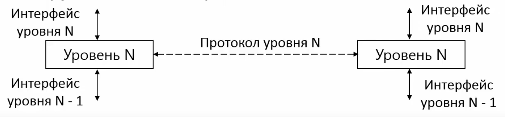

__Интерфейс__
- Реальное взаимодействие между уровнями
- Уровень N вызывает функции уровня N-1, используя интерфейс и полагаясь на сервис (описание этих функций)
__Протокол__:
- Реальное физическое взаимодейсвтие только на физическом уровне.
- Взаимодействие приосходит виртуально.
- Взаимодействие возможно только через заголовки.

# Модели организации сетей
Для того чтобы разные компьютеры с разными системами могли взаимодействовать в рамках одной сети, при организации компьютерных сетей нужно придерживаться эталонным моделям.
2 самые популярные это:
Теоретическая OSI:
- Отличная теоретическая база, хорошо описывает эталон взаимодействия внутри компьютерных сетей.
- 7 уровней
- На практике не используется.
- Не описывает протоколы взаимодействия

Практическая TCP/IP:
- 4 уровня
- Широко исолпьзуется на практике, в основном сфер применения - Интернет.

## OSI
__Уровни__
7 - __Прикладной__
6 - __Представления__
5 - __Сеансовый__
4 - __Транспортный__
3 - __Сетевой__
2 - __Канальный__
1 - __Физический__
0 - __Среда передачи данных__

__Прикладной__:
Набор приложений, которые могут исопльзовать пользователи в сети.
- Гипертекстовые WEB страницы
- Социальные сети
- Видео аудиосвязь
- электронная почта
- и так далее.

Передаваемые данные: Сообщения

__Представления__:
Согласует синтаксис и передаваемые данные - 
Формат символов
формат чисел
Шифрование и дешифрование

Передаваемые данные: Сообщения

__Сеансовый__:
Позволяет устанавливать сеансы связи.
Определение очередности передачи сообщений в диалоге
Например в видеоконференции одновременно говорящие люди т.е. одновременно посылают сообщения друг другу - вот сеансовый уровень решает эту проблему
Определение очередности и предотвращение одновременного доступа к критическим опреациями. Например транзацкии в банковских счетах.
Синхронизация - Предоставляет защиту от разрыва сетевого уровня. Работа продолжится, после того как соединение востановится.

Передаваемые данные: Сообщения

__Транспортный уровень__:
Обеспечивает передачу данных между процессами на хостах
Сквозной - сообщения передаются напрямую от процесса-отправителя к процессу-получателю.
Управляет надежностью:
Предоставляет сервис - защищенный от ошибок канал с гарантированной очередностью сообщений.

Передаваемые данные: Сегмент\Дейтаграмма

__Сетевой__:
Объединяет сети, построенные на основе разных технологий
Создает составную сеть с учетом различий в сетях.
Адресация
Маршрутизация - определение маршрута пересылки пакетов в составной сети.

Передаваемые данные: Пакет

__Канальный__:
Определяет начало и конец соощения в потоке бит.
Обнаруживает и корректирует ошибки
Управляет доступом к среде передачи данных Например: только один комп в один момент времени в широковещательной сети передает данные.
Физическая адресация

Передаваемые данные: Кадр

__Физический__:
Передает биты по физическому каналу.
Никак не анализирует информацию, которая к нему поступает.
Задача: Представить биты информации в качесвте сигналов, передаваемых по среде (по проводам и тд.)

Передаваемые данные: Бит

## TCP/IP

Эту модель организации сетей начали исопльзовать из-за её популярности. Эта модель рассказывает как организовать сеть так, чтобы в ней работал стек протоколов TCP/IP.
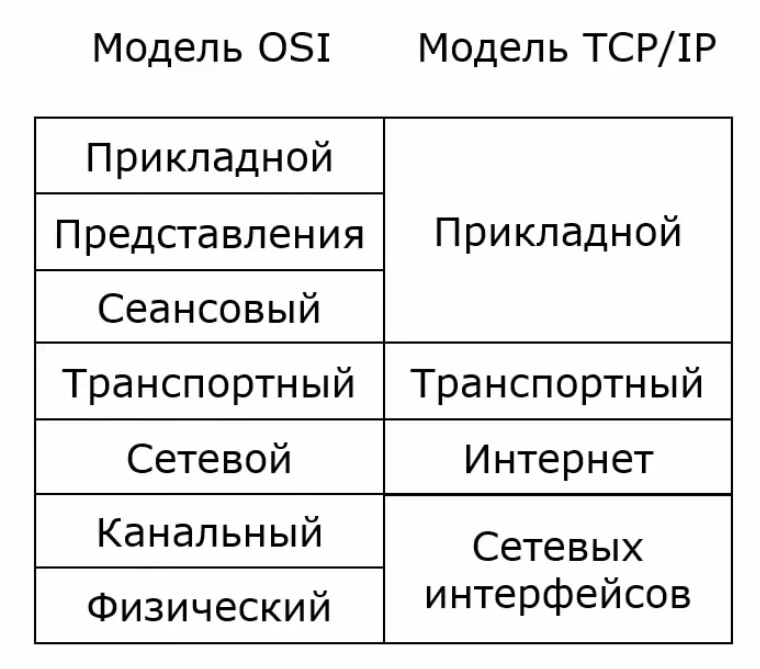
__Уровень сетевых интерфейсов__ - это не настоящий уровень, а интерфейс, который обеспечивает взаимодействие с различными сетевыми технологиями, например Ethernet, Wifi и др.

Более используемая вариацая TCP/IP + OSI
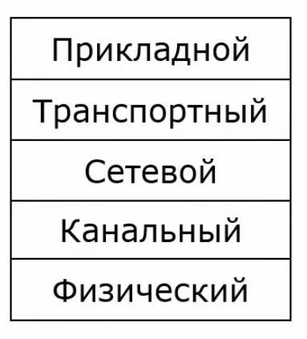

Эта модель плохо подохдит для теоретического описания, так как описывает только модель взаимодействия и стек протоколов TCP/IP.

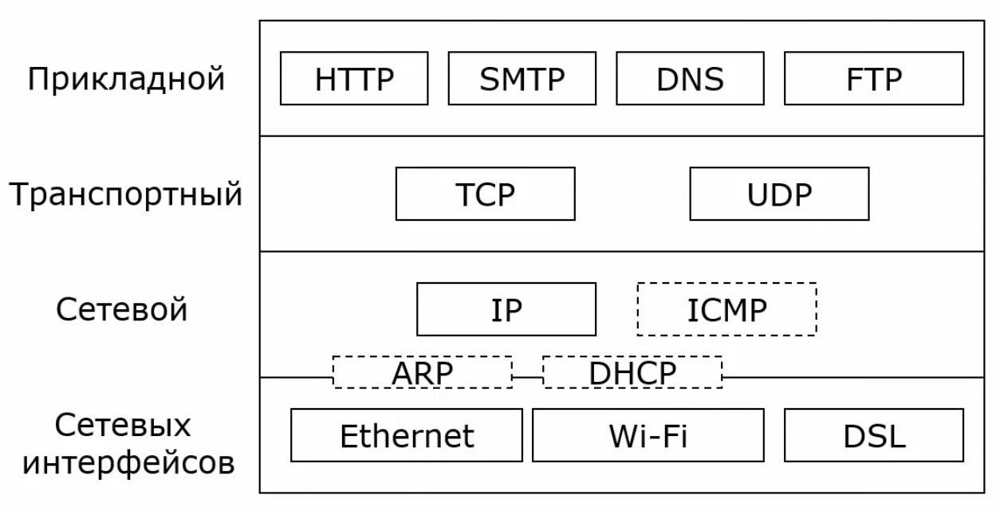

# Физический уровень
__Сервис:__
Передача потока __бит__ по среде передачи данных

Не вникает в __смысл__ передаваемой __информации__
Единица передачи информации - __бит__

__Задача:__
Представить биты информации в виде сигналов, передаваемых по среде передачи данных.

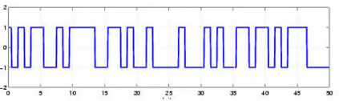

В среде передачи данных бывают искажения данных, поэтому получатель принимает не оригинальный сигнал, а с шумами.

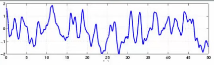

Этой задаче занимается физический уровень.

__Характеристики канала связи:__
- __Пропускная способность бит/с__ - сколько данных моно передать за единицу времени
- __Задержка__ - сколько времени пройдет, прежде чем сообщение пройдет от отправителя дополучателя
- __Количество ошибок__ - насколько часто возникают ошибки
Если ошибки возникают редко, то их можно исправлять на вышестоящих уровнях взаимодействия откртых систем.

__Типы каналов связи:__
- __Симплексный__ - можно передавать данные только в одну сторону.
- __Дуплексный__ - можно передавать данные в обе стороны одновременно.
- __Полудуплексный__ - можно передавать данные в обе стороны, но поочередно.

__Среды передачи данных:__

* __Кабель__
    - телефонный кабель
    - коаксильный кабель
    - витая пара
    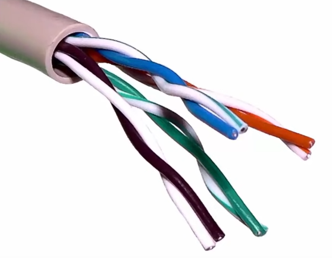
    2 медных кабеля в оболочке сплетаются между собой попарно - это нужно для уменьшения помех. В одном кабеле как правило 4 витые пары.
    - оптический кабель
    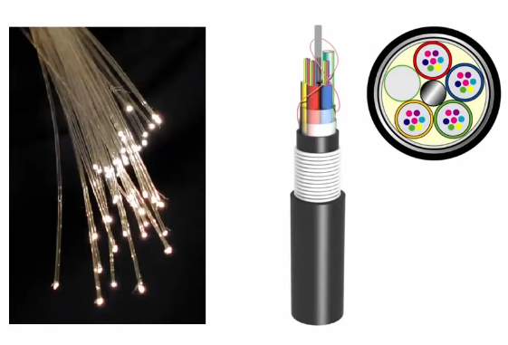
    В оптическом кабеле для передачи данных исопльзуются тонкие световоды. Световоды покрываются оболочкой, затем объединяется несколько групп сетоводов в один кабель.
    - провода электропитания 220В

* __Беспроводные технологии__
    - Радиоволны
    - Инфрокрасное излучение

* __Спутниковые каналы__
* __Беспроводная оптика (лазеры)__

# Канальный уровень
__Задачи:__
Передача сообщений по каналам связи. Сообщения называются кадры (frame).
Определение начала и конца кадра в потоке бит.
Обнаружение и коррекция ошибок.

Менеджмент множественного досутпа к каналу связи:
- Адресация
- Согласованныйф доступ к каналу.

### Работа с кадрами
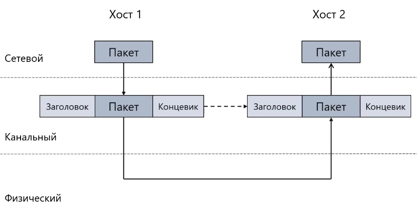

__Кадр__ - это Заголовок + пакет + концевик

__Методы выделения кадров__:
- __Указатель количества байт__ - Самый просто способ. Просто указываем длину в начале каждого кадра.
Прост в реализации, но при искажении сообщения длина может  так же исказиться.

- __Вставка байтов__ - Начало и конец каждого кдара отмечается специальной последовательностью байтов.
Протокол BSC - текстовые символы:
- DLE STX - Начало кадра
- DLE ETX - Конец кадра
- Escape последовательность данных - DLE

- __Вставка битов__ - Начало и конец кжадого кдара отмечается специальной последовательностью битов.
Протоколы HDLC, PPP - биты:
- 01111110 начало и конец кадра
- Чтобы не было такого, что начало и конец кадра - это на самом деле сообщение, в само сообщение добавляем 0 после последовательности из пяти 1, таким образом совпадений никогда не будет.

- __Средства физического уровня__
Преамбула (классический Ethernet)
- длина 8 байт
- первые 7 байт: 10101010
- Последний байт: 10101011 (ограничитель кадра)

Передача неисопльзуемых символов избыточного кода (Fast Ethernet)
- начало кадра - пара символы J(11000) и K(10001)
- конец кадра - символ  T(01101)

### Обнаружение и исправление ошибок
Обнаржуение - Обнаружена ошибка, то этот код просто отбрасывается, воставновления нет:
Например алгоритм - __контрольная сумма__

Исправление - не отбрасывает ошибку, а пытается ее исправить
Например:
- Коды исправляющей ошибки (с избыточной информацией)
- позволяют обнаруживать и исправлять ошибки

Повторная отправка данных- не пытается исправить ошибку, а просто заново пытается отправить пакеты:

Метод Остановка и ожидание - исопльзуется в Wi-Fi.
Отправитель передает сообщение получаетлю. Если все окей, получатель передает подтверждение отправителю. И так далее.
Если отправитель передал сообщение получателю, получатель обнаружил ошибку или сообщение вообще не долшло то получатель не может отправить подтверждение. 
Отправитель во время отправки сообщения запускает таймер передачи, если время истекло, отправляем сообщение еще раз.

Метод Скользящее окно - высокоскоростные каналы связи, в TCP в транспотном уровне.
Отправитель передает несколько кадров один за другим, не дожидаясь подтверждения.
Количество кадров, которое можно отправить называется размер окна.
Получатель подвтерждает получение кадров и отправитель передает новую порцию.

### Множественный доступ к каналам
Модель OSI разрабатывалась для каналов связи точка-точка:
- последовательные линии связи для соединения больших компьютеров.

Когда распространились разделяемые каналы связи, модель пришлось поменять.
Канальный:
__1) Подуровень управления логическим каналом (Logical Link Control, LLC):__
- Отвечает за передачу данных (создание кдаров, обработка ошибок и тд)
- Общий для разных технологий
- Мультиплексирование. Передача данных разных протоколов (IP, ARP, ICMP) на MAC подуровень.
- Управление потоком. Предотвращение "Затопления" медленного получателя быстрым отправителем.

__2) Подуровень управления доступом к среде (Media Acces Control, MAC)__
- Совместное использование разделяемой среды
- Адресация
- Специфичный для разных технологий
- Не является обязательным

## Ethernet
## Mac адреса
## Ethernet. Метод доступа к разделяемой среде CSMA/CD
## Комутаторы Ethernet
## Канальный уровень Wireshark
## VLAN
## STP протокол
## Wi-Fi протокол
## Wi-Fi. Метод доступа к разделяемой среде CSMA/CD
## Wi-Fi. Формат кадра
## Сервисы Wi-Fi.