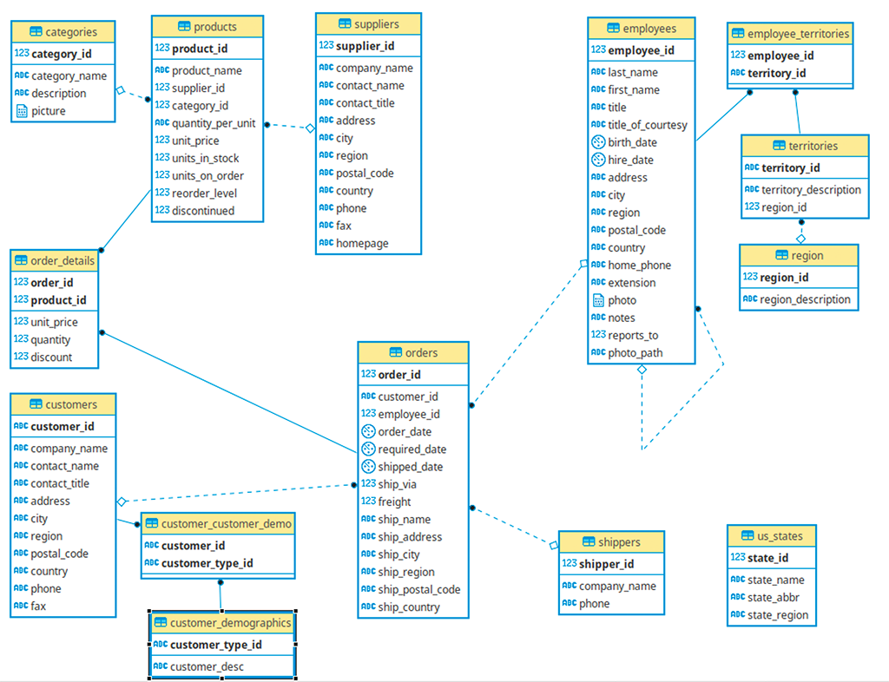

[Соглашение по синтаксису SQL](https://www.sqlstyle.guide/ru/)
# Почему PostgreSQL?
* Бесплатный. Open Source.
* Легкая установка, даже без настройки.
* Хорошая транзакционность из коробки.
* Развитый диалект SQL.
* 90% диалекта PostgreSQL можно исопльзовать в других СУБД.

# Основные типы данных в PostgreSQL
__decimal/numeric__ - желательно исопльзовать для денег. так как другие типы могут накапливать ошибки.
__real/float4__ - исопльзуются в точных вычислениях.

__text__ - можно не указывать кол-во символов.
__bool__ - No, N, 0, Yes, Y, 1 - конвертируются в bool.

Это основные временные типы данных, есть еще дофига.

Так же есть:
* Arrays
* JSON
* XML
* Геометрические и другие типы
* custom - можно самому создавать типы данных
* NULL

# Создание БД
DROP DATABASE/TABLE [имя] - удалить базу данных/таблицу
CREATE DATABASE [имя] - создать базу данных
CREATE TABLE [имя] - создать таблицу
NOTNULL - Запрет пустого значения
PRIMARY KEY - Отмечает первичный ключ
CONSTRAINT - задание ограничений для таблицы, в данном случае создает имя для id

```SQL
CREATE TABLE publisher (
	publisher_id INTEGER NOT NULL,
	org_name VARCHAR(128) NOT NULL,
	adress TEXT NOT NULL,
	
	CONSTRAINT pk_publisher_id PRIMARY KEY (publisher_id)
);

CREATE TABLE book ( 
	book_id INTEGER NOT NULL,
	title TEXT NOT NULL,
	isbn VARCHAR(32) NOT NULL,
	
	CONSTRAINT pk_book_id PRIMARY KEY (book_id)
);
```

# Вставка данных в таблицу
INSERT - Вставить
INTO - куда?
VALUES - что?

Вариант 1.
```SQL
INSERT INTO book VALUES (1, 'The Diary of a Young Girl', '0199535566');
INSERT INTO book VALUES (2, 'Pride and Prejudice', '9780307594006');
INSERT INTO book VALUES (3, 'To Kill a Mockingbird', '032453242');
INSERT INTO book VALUES (4, 'The book of Gutsy Women', '2313428642');
INSERT INTO book VALUES (5, 'War and Peace', '169332468762');
```

Вариант 2.
```SQL
INSERT INTO book 
VALUES 
(1, 'The Diary of a Young Girl', '0199535566'),
(2, 'Pride and Prejudice', '9780307594006'),
(3, 'To Kill a Mockingbird', '032453242'),
(4, 'The book of Gutsy Women', '2313428642'),
(5, 'War and Peace', '169332468762');
```

Вариант 3.
```SQL
INSERT INTO public.book(
	book_id, title, isbn)
	VALUES (42, 'Valentines book', '19087521342341345345');
	
INSERT INTO public.publisher(
	publisher_id, org_name, adress)
	VALUES (922, 'Valentines', 'Puschino');
```

```SQL
INSERT INTO publisher
VALUES
(1, 'Everyman library', 'NY'),
(2, 'Oxford press', 'NY'),
(3, 'Grand publisher', 'Washington'),
(4, 'Simon', 'Chicago')
```

Для создание отношений используются foreign keys.
ALTER - для изменения
ADD - Добавить
REFERENCES - на что ссылается FOREIGN KEY
```SQL
ALTER TABLE book
ADD COLUMN publisher_id INTEGER;

ALTER TABLE book
ADD CONSTRAINT fk_publisher_id
FOREIGN KEY(publisher_id) REFERENCES publisher(publisher_id);
```

# Отношение один ко многим
Один издатель может издать много книг
У книги может быть один издатель
__Один__ издатель __ко многим__ книгам
```SQL
CREATE TABLE book(
	_id INTEGER NOT NULL,
	title TEXT NOT NULL,
	isbn VARCHAR(32) NOT NULL,
	publisher_id INTEGER NOT NULL,
	
	CONSTRAINT pk_book_id PRIMARY KEY(_id),
	CONSTRAINT fk_publisher_id FOREIGN KEY(publisher_id)
	REFERENCES publisher(publisher_id)
);
```
# Отношение один к одному
Очень похоже на отношение один ко многим, но foreign key должен бытьу униклаьным.
# Отношение многие ко многим
Данное отношение всегда моделируется с помощью введение 3-й таблицы.
таблица Книга.
таблица Автор.
таблица Автор_Книга. Где мы сопостовляем id книги и id автора. Но пары в этой таблице уникальны:
1 - 1
1 - 1 
такого не должно быть.
Для этого можно отдельно задать Primary key как пересечение двух таблиц:
CONSTRAINT table_table PRIMARY KEY (table1_id, table2_id)

# Учебная база данных от Microsoft
[Ссылка на репозиторий с этой базой](https://github.com/pthom/northwind_psql)


# Простые запросы к базе
## Полная выборка
Из-за звездочки сильно теряется производительность. Так как одновременно нужно вывести дохуища данных.
SELECT * 
FROM name1, name2

## Выборка и элементарные арифметические операции
```SQL
SELECT order_id, shipped_date - order_date AS shiping_time 
FROM orders;
```

__+__ сложение
__-__ вычитание 
__*__ умножение
__/__ деление
__^__ степень
__|/__ квадратный корень

## DISTINCT - вывод уникальных строк.
Все лишние дубликаты не показываются.
```SQL
SELECT DISTINCT city
FROM employees;
```

## COUNT - подстчет результирующих строк
```SQL
SELECT COUNT(*)
FROM employees;

SELECT COUNT(DISTINCT country)
FROM employees;
```

## WHERE
SELECT *
FROM table
WHERE condition;

```SQL
SELECT column_name
FROM information_schema.columns
WHERE "table_name" = 'customers';

SELECT country, company_name, contact_name, phone
FROM customers
WHERE country = 'USA';

SELECT *
FROM products
WHERE unit_price > 20
ORDER BY unit_price;

SELECT COUNT(*)
FROM products
WHERE unit_price > 20;

SELECT *
FROM products
WHERE discontinued = 1;

SELECT *
FROM customers
WHERE city != 'Berlin'
ORDER BY city;

SELECT order_date
FROM orders
WHERE order_date >= '1945-01-01'
```

## AND OR
```SQL
SELECT DISTINCT order_id, contact_name, shipped_date - order_date as shippimg_time
FROM customers, orders
WHERE (shipped_date - order_date) < 10 AND contact_name LIKE 'B%'
ORDER BY contact_name;
```

## BETWEEN
нестрогое
[1; 100]
'>=1 and <=100'

## Вывод названия и тип данных столбцов.
```SQL
SELECT
    column_name,
    data_type
FROM
    information_schema.columns
WHERE
    table_name = 'products';
```

## IN, NOT IN
Вместо OR в данном случае лучше исопльзовать IN
```SQL
SELECT contact_name, country
FROM customers
WHERE 
country = 'Mexico' OR
country = 'Germany' OR
country = 'USA' OR
country = 'Canada';

SELECT contact_name, country
FROM customers
WHERE country IN (
'Mexico',
'Germany',
'USA',
'Canada'
)
```

## ORDER BY
упорядычивание по убывающей ASC
по возрастающей DESC

```SQL
SELECT contact_name, country
FROM customers
WHERE country NOT IN (
'Mexico',
'Germany',
'USA',
'Canada'
)
ORDER BY country ASC, contact_name ASC;
```

## MIN MAX AVG SUM
Выведет минимальное значение, максимальное или среднее арифметическое.
SUM - выведет сумму всех значений.
```SQL
SELECT MIN (order_date)
FROM orders 
WHERE ship_city = 'London';

SELECT MAX (order_date)
FROM orders 
WHERE ship_city = 'London';

SELECT AVG (unit_price)
FROM products
WHERE discontinued != 1;

SELECT SUM (unit_price)
FROM products;
```

## LIKE
% - заполнитель, placeholder 0,1 и более символов.
_ - 1 любой символ

LIKE 'U%' - строки, начинаются с U
LIKE '%a' - строки, заканчиваются на a
LIKE '%John%' - строки, содержащие John
LIKE '_oh_' - строки, где 2-й, 3-й символы oh, а первый и полсдений - любые

## LIMIT
Ограничение кол-во записей в результирующей таблице.
LIMIT 10 - 10 записей
Ставится в конце.

## IS NULL
```SQL
SELECT *
FROM table_name
WHERE item IS NULL или IS NOT NULL.
```

## GROUP BY
```SQL
SELECT ship_country, 
FROM orders
WHERE freight > 50
GROUP BY ship_country
ORDER BY ship_country DESC
```

## HAVING
это постфильтрация.
после фильтра WHERE может понадобится прописать еще один фильтр, поэтому нужно исопльзовать HAVING - это вторичный фильтр.
```SQL
SELECT category_id, SUM (unit_price * unit_in_stock)
FROM products
WHERE discontinued != 1
GROUP BY category_id
HAVING SUM (unit_price * unit_in_stock) > 5000
ORDER BY SUM (unit_price * unit_in_stock) DESC
```

## UNION INTERSECT EXCEPT
UNION ALL - если есть дубликаты, то они останутся, без ALL дубликатов не будет.
EXCEPT ALL - накладывает DISTINCT на левую часть выражения.
```SQL
SELECT country
FROM customers
UNION
SELECT country
FROM employees

SELECT country
FROM customers
INTERSECT 
SELECT country
FROM suppliers

SELECT country
FROM customers
EXCEPT
SELECT country
FROM suppliers
```

# Соединения
Левая таблица - то, что идет первым
Правая таблица - та, что идет второй.
## INNER JOIN
При данном соединении в итоговую выборку попадут только те строки левой таблицы, которые имеют соответствие (по внешнему ключу) в правой таблице.
```SQL
SELECT product_name, suppliers.company_name, units_in_stock
FROM products
INNER JOIN suppliers ON products.supplier_id = suppliers.supplier_id
ORDER BY units_in_stock DESC;

SELECT category_name, SUM(units_in_stock)
FROM products
INNER JOIN categories ON products.category_id = categories.category_id
GROUP BY category_name
ORDER BY SUM(units_in_stock) DESC
LIMIT 10

SELECT order_date, product_name, ship_country, products.unit_price, quantity, discount
FROM orders
INNER JOIN order_details ON orders.order_id = order_details.order_id
INNER JOIN products ON order_details.product_id = products.product_id;

SELECT customers.contact_name, city,  products.product_name
FROM customers
INNER JOIN orders ON customers.customer_id = orders.customer_id
INNER JOIN order_details ON orders.order_id = order_details.order_id
INNER JOIN products ON order_details.product_id = products.product_id
ORDER BY customers.contact_name ASC
LIMIT 10
```
Можно просто JOIN - это означает INNER JOIN


## LEFT JOIN (left outer join)
При данном соединении из левой таблицы попадают абсолютно все записи и при этом, еслии есть соответствиее по внешнему ключу в правой таблице - то происходит обычное соденинение, но если этих соответствий нет, то в значениях там будут NULL
```SQL
SELECT company_name, order_id
FROM customers
LEFT JOIN orders ON orders.customer_id = customers.customer_id
WHERE order_id IS NULL
ORDER BY company_name DESC;
```


## RIGHT JOIN (right outer join)
Работает так же, как и LEFT JOIN, но наоборот. Попадают абсолютно все данные правйо таблицы. Если есть соответствие - то обычное соденинение, если нет - NULL значения.

Но этим соединением редко пользуются, так как достаточно LEFT JOIN, просто поменять местами таблицы при запросе, вот и все.

## FULL JOIN
По сути Left Join + Right Join. Забираем все записи из левой и правой. Если есть совпадения - то выводим. если нет сопоставлений - NULL.


## CROSS JOIN (декартово произведение)
Каждой записи в левой таблице сопоставляем все записи в правой таблице. Не учитывается внешний ключ. Просто берем левую таблицу и каждой записи сопоставляем каждую правую.
Если в левой таблице 2 строки, а вправой 10 строк и эти таблицы никакими ключами не связаны, то декартов произведение просто перемножит их и получится, что 2 строки левой таблицы выведутся по 10 раз каждая.
тупое перемножение.


## SELF JOIN
чаще всего нужен для построения некой иерархии, когда есть некоторое иерархиеское взаимоотношение между данными.
Например в сущности employee - сотрудники. У каждого сотрудника есть id, а еще у некоторых сотрудников есть manager (менеджер) у которого тоже есть manager_id и он тоже является сотрудником.
Получается каждый Сотрудник может ссылаться на своего менеджера, как на сотрудника.
```SQL
CREATE TABLE employee(
	employee_id INT PRIMARY KEY,
	first_name VARCHAR (255) NOT NULL,
	last_name VARCHAR (255) NOT NULL,
	manager_id INT,

	FOREIGN KEY (manager_id) REFERENCES employee (employee_id)
);

SELECT e.first_name || ' ' || e.last_name AS employee,
	   m.first_name || ' ' || m.last_name AS manager
FROM employee e
LEFT JOIN employee m ON m.employee_id = e.manager_id
ORDER BY manager;
```

Пример на базе Northwind. У каждого сотрудника есть возможность подать жалобу на другого сотрудника. Вот мы объединяем сотрудников и тех, на кого подали жалобу.
```SQL
SELECT e.employee_id || ')' || e.last_name,
       r.employee_id || ')' || r.last_name
FROM employees AS e, employees AS r
WHERE e.reports_to = r.employee_id;

SELECT e.employee_id || ')' || e.last_name,
       r.employee_id || ')' || r.last_name
FROM employees AS e
LEFT JOIN employees AS r ON e.reports_to = r.employee_id;

SELECT e.employee_id || ' ' || e.last_name,
-- 			 r.employee_id || ' ' || r.last_name
COUNT (r.employee_id)
FROM employees AS e
LEFT JOIN employees as r ON e.employee_id = r.reports_to
GROUP BY e.employee_id
ORDER BY e.employee_id
```

## USING и NATURAL JOIN
Синтаксический сахар.
Вместо этого запроса, можно сделать вот такой запрос
```SQL
SELECT contact_name, company_name, phone, first_name, last_name, title,
			 order_date, product_name, ship_country, products.unit_price, quantity, discount
FROM orders
JOIN order_details ON orders.order_id = order_details.order_id
JOIN products ON order_details.product_id = products.product_id
JOIN customers ON orders.customer_id = customers.customer_id
JOIN employees ON orders.employee_id = employees.employee_id
WHERE ship_country = 'USA'			 
```
```SQL
SELECT contact_name, company_name, phone, first_name, last_name, title,
			 order_date, product_name, ship_country, products.unit_price, quantity, discount
FROM orders
JOIN order_details ON orders.order_id = order_details.order_id
JOIN products ON order_details.product_id = products.product_id
JOIN customers ON orders.customer_id = customers.customer_id
JOIN employees ON orders.employee_id = employees.employee_id
WHERE ship_country = 'USA'			 
```
Если одинаковые наименования. Исопльзуем USING(поле) и теперь код стал более читабельным.
```SQL
SELECT contact_name, company_name, phone, first_name, last_name, title,
			 order_date, product_name, ship_country, products.unit_price, quantity, discount
FROM orders
JOIN order_details USING(order_id) -- ON orders.order_id = order_details.order_id
JOIN products USING(product_id) -- ON order_details.product_id = products.product_id
JOIN customers USING(customer_id) -- ON orders.customer_id = customers.customer_id
JOIN employees USING(employee_id) -- ON orders.employee_id = employees.employee_id
WHERE ship_country = 'USA'
```
А можно еще короче, даже без USING. Он сам проходит по всем столбцам и объединяет, но проблема в том, что код не читаемый. Сложнее отлаживать. А еще он часто багуется. Так как вдруг будут введены столбцы с одинаковыми именами.
```SQL
SELECT *
FROM orders
NATURAL JOIN employees
```

# Подзапросы
В первом случае используем подзапрос, во втором случае обычный JOIN.
Но такая замена JOIN не всегда возможна.
```SQL
-- Вывести страны, одинаковые для поставщиков и для заказчиков
SELECT suppliers.company_name
FROM suppliers
WHERE suppliers.country IN
(SELECT customers.country FROM customers)
ORDER BY suppliers.company_name ASC;

SELECT DISTINCT suppliers.company_name
FROM suppliers
JOIN customers USING (country)
ORDER BY suppliers.company_name ASC;
```
```SQL
-- вывести сумму единиц товара, разбитых на группы
-- и лимитировать результат числом = (наименьший продукт id + 4)
SELECT categories.category_name, SUM( products.units_in_stock)
FROM products
JOIN categories USING(category_id)
GROUP BY categories.category_name
ORDER BY SUM( products.units_in_stock) DESC
LIMIT (SELECT MIN(product_id) + 4 FROM products);

-- вывести такие товары, кол-во которых в наличии больше чем в среднем
SELECT products.product_name, products.units_in_stock
FROM products
WHERE products.units_in_stock > 
(SELECT AVG(products.units_in_stock)
FROM products)
ORDER BY products.units_in_stock DESC;
```

## WHERE EXISTS
Эта конструкция с подзапросом внутри возвращает true, когда подзапрос вернет хотя бы одну строку.
как правило эти подзапросы можно переписать с помощью Join (как в примере ниже, запрос 1 и 2)
```SQL
SELECT DISTINCT company_name, contact_name
FROM customers
WHERE EXISTS(
SELECT company_name, freight 
FROM orders
WHERE
customers.customer_id = orders.customer_id AND
freight BETWEEN 50 AND 100)
ORDER BY company_name;


SELECT DISTINCT company_name, contact_name
FROM orders
JOIN customers USING(customer_id)
WHERE freight BETWEEN 50 AND 100
ORDER BY company_name;

SELECT company_name, contact_name
FROM customers
WHERE NOT EXISTS(
SELECT customer_id FROM orders
WHERE customer_id = customers.customer_id
AND order_date BETWEEN '1995-02-01' AND '1995-02-15')

SELECT product.product_name
FROM products as product
WHERE NOT EXISTS (SELECT orders.order_id FROM orders
JOIN order_details USING(order_id)
WHERE 
order_details.product_id = product_id AND
order_date BETWEEN '1995-02-01' AND '1995-02-15')
```

## ANY ALL кванторы
ANY, например запрос должен быть больше ЛЮБОГО значения.
ALL, например запрос должен быть больше ВСЕХ значений.
```SQL
SELECT DISTINCT company_name
FROM customers
JOIN orders USING(customer_id)
JOIN order_details USING(order_id)
WHERE quantity > 40;


SELECT DISTINCT company_name
FROM customers
WHERE customer_id = ANY(
	SELECT customer_id
	FROM orders
	JOIN order_details USING(order_id)
	WHERE quantity > 40
);

SELECT product_name, quantity
FROM products
JOIN order_details USING(product_id)
WHERE quantity > ALL(
	SELECT AVG(quantity)
	FROM order_details
	GROUP BY product_id)
ORDER BY quantity;
```

# DDL - Data Definition Language
Управление таблицами.
CREATE TABLE - создание таблицы
ALTER TABLE - изменить таблицу
    ADD COLUMN - добавить столбец в таблицу
    RENAME TO - переименование таблицы
    RENAME [old] TO [new] - переименование столбца
    ALTER COLUMN [column_name] SET DATA TYPE [data_type]
DROP TABLE - удаление таблицы
TRUNCATE TABLE - удаляет все данные внутри таблицы (и даже логи таблицы), жесткий снос данных. Но не может удалить данные, если на эти данные есть ссылка из других таблиц. (То есть при наличии связей по ключам, нее выйдет удалить)
DROP COLUMN - удаление колонок.

# Sequence
CREATE SEQUENCE [name] - Добавляет последовательности
select nextval('name') - что-то по типу getNext()
drop sequence [name] - удаляем последовательность
SERIAL - псевдотип данных (синт. сахар) = int + sequence

Это стандартный новый синтаксис, тоже самое, что и SERIAL, но зато новый.
create table myTable(
	id int GENERATED BY DEFAULT AS IDENTITY
);

А вот так можно обновить поле и привязать к нему секвенцию
alter table accounts
alter column balance
set default nextval('public.accounts_balance_seq'::regclass);

А вот така удалить
alter table accounts alter column id drop default;
drop sequence accounts_id_seq;

# Каскадирование

user_id int REFERENCES Person (user_id) ON DELETE [CASCADE | SET NULL | RESTRICT]

Cascade - при удалении, все связанные данные удалятся.
Set Null - при удалении, данные не удалятся, а просто значение внешнего ключа обнулится (NULL)
Restrict - при удалении, выдаст ошибку. (по умолчанию)

# Check
Ограничение поля.
например
age int check (age > 0) // не может быть меньше 0.